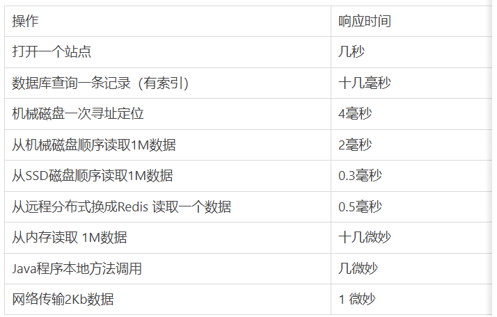

* 1.概述篇
    * 1.1 大厂面试题
    * 1.2 背景说明
        * 1.2.1 生产环境中的问题
        * 1.2.2 为什么要调优
        * 1.2.3 不同阶段的考虑
    * 1.3 调优概述
        * 1.3.1 监控的依据
        * 1.3.2 调优的大方向
    * 1.4 性能优化的步骤
        * 第1步(发现问题)：性能监控
        * 第2步(排查问题)：性能分析
        * 第3步(解决问题)：性能调优
    * 1.5 性能评价/测试指标
        * 1.5.1 停顿时间（或响应时间）
            * 1.5.1.1 响应时间  
            * 1.5.1.2 垃圾回收环节中
            * 1.5.2 吞吐量
            * 1.5.3 并发数
            * 1.5.4 内存占用
            * 1.5.5 吞吐量、并发数、响应时间 间关系
            
## 1.概述篇

#### 1.1 大厂面试题

- 支付宝
     - 支付宝三面：JVM性能调优都做了什么？
- 小米
   - 有做过JVM内存优化吗？
   - 从SQL、JVM、架构、数据库四个方面讲讲优化思路？
- 蚂蚁金服：
     - JVM的编译优化？
     - jvm性能调优都做了什么？
     - JVM诊断调优工具用过哪些？
     - jvm怎样调优，堆内存、栈空间设置多少合适？
     - JVM相关的分析工具使用过的有哪些，具体的性能调优步骤如何？

- 阿里
  - 如何进行JVM调优，有哪些方法？
  - 如何理解内存泄漏问题？
  - 有哪些情况会导致内存泄漏？如何解决？

- 字节跳动
  - JVM如何调优、参数怎么调？

- 拼多多
  - 从SQL、JVM、架构、数据库四个方面讲讲优化思路

- 京东
  - JVM诊断调优工具用过哪些？
  - 每秒几十万并发的秒杀系统为什么会频繁发生GC？
  - 日均百万级交易系统如何优化JVM？
  - 线上生产系统OOM如何监控及定位与解决？
  - 高并发系统如何基于G1垃圾回收器优化性能？

#### 1.2 背景说明

##### 1.2.1 生产环境中的问题

- 生产环境发生了内存溢出该如何处理？

- 生产环境应该给服务器分配多少内存合适？

- 如何对垃圾回收器的性能进行调优？

- 生产环境CPU负载飙高该如何处理？

- 生产环境应该给应用分配多少线程合适？

- 不加log，如何确定请求是否执行了某一行代码？

- 不加log，如何实时查看某个方法的入参与返回值？

##### 1.2.2 为什么要调优

- 防止出现OOM

- 解决OOM

- 减少Full GC出现的频率

##### 1.2.3 不同阶段的考虑

- 上线前

- 项目运行阶段

- 线上出现OOM

#### 1.3 调优概述

##### 1.3.1 监控的依据

- 运行日志

- 异常堆栈

- GC日志

- 线程快照

- 堆转储快照

##### 1.3.2 调优的大方向

- 合理地编写代码

- 充分并合理的使用硬件资源

- 合理地进行JVM调优

#### 1.4 性能优化的步骤

##### 第1步(发现问题)：性能监控

- GC频繁

- cpu load过高

- OOM

- 内存泄露

- 死锁

- 程序响应时间较长

  

##### 第2步(排查问题)：性能分析

- 打印GC日志，通过GCviewer或者 http://gceasy.io 来分析异常信息

- 灵活运用命令行工具、jstack、jmap、jinfo等

- dump出堆文件，使用内存分析工具分析文件

- 使用阿里Arthas、jconsole、JVisualVM来实时查看JVM状态

- jstack查看堆栈信息

##### 第3步(解决问题)：性能调优

- 适当增加内存，根据业务背景选择垃圾回收器

- 优化代码，控制内存使用

- 增加机器，分散节点压力

- 合理设置线程池线程数量

- 使用中间件提高程序效率，比如缓存、消息队列等

- 其他……

#### 1.5 性能评价/测试指标

##### 1.5.1 停顿时间（或响应时间）

###### 1.5.1.1 响应时间

提交请求和返回该请求的响应之间使用的时间，一般比较关注平均响应时间。常用操作的响应时间列表：

###### 1.5.1.2 垃圾回收环节中

①暂停时间：执行垃圾收集时，程序的工作线程被暂停的时间。

②参数-XX:MaxGCPauseMillis

##### 1.5.2 吞吐量

①定义：对单位时间内完成的工作量（请求）的量度

②参数XX::GCTimeRatio=n

表示希望在GC花费不超过应用程序执行时间的1/(1+n)，n为大于0小于100的整数。即运行用户代码的事件占总运行时间的比例（总运行时间：程序的运行时间+内存回收的时间）

换句话说，此参数的值表示运行用户代码时间是GC运行时间的n倍。

举个官方的例子，参数设置为19，那么GC最大花费时间的比率=1/(1+19)=5%，程序每运行100分钟，允许GC停顿共5分钟，其吞吐量=1-GC最大花费时间比率=95%

默认情况下，VM设置此值为99，运行用户代码时间是GC停顿时间的99倍，即GC最大花费时间比率为1%

##### 1.5.3 并发数

定义：同一时刻，对服务器有实际交互的请求数

例如1000人同时在线，并发数5%，也就是说并发量是50

##### 1.5.4 内存占用

Java堆区所占的内存大小

##### 1.5.5 吞吐量、并发数、响应时间 间关系

吞吐量：每天高速公路收费站通过的车辆的数据

并发数：高速公路上正在行驶的车辆的数量

响应时间：车速

**三者间关系：**

- 并发数少，车速高，吞吐量小；
- 并发数中，车速慢，吞吐量高；
- 并发数高，车速为0，吞吐量为0（服务器资源耗尽）

