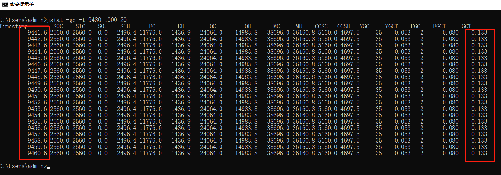

* 2.JVM监控及诊断工具-命令行篇
    * 2.1 概述
        * 2.1.1 心得体会
        * 2.1.2 简单命令行工具
    * 2.2 jps:查看正在运行的Java进程
        * 2.2.1 jps的基本概念
        * 2.2.2 options参数
        * 2.2.3 hostid参数：远程主机id
    * 2.3 jstat：查看JVM统计信息
        * 2.3.1 jstat基本概念
        * 2.3.2 基本语法的参数
        * 2.3.3 jstat的使用
            * ①jstat -class -t -h 3 9480 1000 10
            * ②jstat -gc -t 9480 1000 3
        * 2.3.4 jstat的其他作用
            * ①检查是否会OOM  
            * ②判断是否出现内存泄漏
    * 2.4 jinfo：实时查看和修改JVM配置参数
        * 2.4.1 概念
        * 2.4.2  具体用法
            * 2.4.2.1 查看JVM配置的参数
            * 2.4.2.2 修改JVM配置的参数
    * 2.5 jmap：导出内存映像文件&内存使用情况
        * 2.5.1 概念
        * 2.5.2 基本用法
            * 2.5.2.1 导出内存映像文件的输出
            * 2.5.2.2  显示堆内存相关信息
            * 2.5.2.3 其他作用
    * 2.6 jhat：JVM中堆分析工具
    * 2.7 jstack：JVM中线程快照
    * 2.8 jcmd：多功能命令行
    * 2.9 jstatd：远程主机信息收集
    
### 2.JVM监控及诊断工具-命令行篇


#### 2.1 概述

性能诊断工具一般诊断线程控制、磁盘读写、数据库访问、网络I/O、垃圾收集等这些问题。


##### 2.1.1 心得体会

- 使用数据说明问题，使用知识分析问题，使用工具处理问题。

- 无监控、不调优！


##### 2.1.2 简单命令行工具


官方源码地址：http://hg.openjdk.java.net/jdk/jdk11/file/1ddf9a99e4ad/src/jdk.jcmd/share/classes/sun/tools


##### 2.2 jps:查看正在运行的Java进程

##### 2.2.1 jps的基本概念

- jps(Java Process Status)：可用于查询正在运行的虚拟机进程(进程ID等同于操作系统的进程ID)。

- 基本使用语法为：jps [options] [hostid]   
- 常用命令：jps -l

- 关闭默认开启的参数 -XX:-UsePerfData，则jps无法探知该 Java进程


##### 2.2.2 options参数

- -q：仅仅显示进程id，不显示主类的名称等

- -l：输出应用程序主类的全类名 或 如果进程执行的是jar包，则输出jar完整路径

- -m：输出虚拟机进程启动时传递给主类main()的参数

- -v：列出虚拟机进程启动时的JVM参数。比如：-Xms20m -Xmx50m是启动程序指定的jvm参数

  

##### 2.2.3 hostid参数：远程主机id


#### 2.3 jstat：查看JVM统计信息

##### 2.3.1 jstat基本概念

- jstat（JVM Statistics Monitoring Tool）：用于监视虚拟机各种运行状态信息的命令行工具。

- jstat常用于检测**垃圾回收问题**以及**内存泄漏问题**。

- 官方文档：https://docs.oracle.com/javase/8/docs/technotes/tools/unix/jstat.html

- 基本使用语法：jstat -<option> [-t] [-h<lines>] <vmid> [<interval> [<count>]]

##### 2.3.2 基本语法的参数

- interval参数：查询间隔，单位为毫秒。

- count参数：用于指定查询的总次数

- -t参数：显示程序的运行时间。单位：秒

- -h参数：输出多少行数据后输出一个表头信息

- option参数：

  - 类装载相关的：

    - -class：显示ClassLoader的相关信息：类的装载、卸载数量、总空间、类装载所消耗的时间等
  - JIT相关的：
    - -compiler：显示JIT编译器编译过的方法、耗时等信息
    - -printcompilation：输出已经被JIT编译的方法
  - 垃圾回收相关的：
    - -gc：显示与GC相关的堆信息。包括Eden区、两个Survivor区、老年代、永久代等的容量、已用空间、GC时间合计等信息。
    - -gccapacity：显示内容与-gc基本相同，但输出主要关注Java堆各个区域使用到的最大、最小空间。
    - -gcutil：显示内容与-gc基本相同，但输出主要关注已使用空间占总空间的百分比。
    - -gccause：与-gcutil功能一样，但是会额外输出导致最后一次或当前正在发生的GC产生的原因。
    - -gcnew：显示新生代GC状况
    - -gcnewcapacity：显示内容与-gcnew基本相同，输出主要关注使用到的最大、最小空间
    - -geold：显示老年代GC状况
    - -gcoldcapacity：显示内容与-gcold基本相同，输出主要关注使用到的最大、最小空间
    - -gcpermcapacity：显示永久代使用到的最大、最小空间


##### 2.3.3 jstat的使用

###### ①jstat -class -t -h 3 9480 1000 10

含义：JVM中PID为9480 的进程，打印类加载信息，并显示程序运行的时间；

​          1000ms即1s打印一次，打印10次；

​           而且每打印3次都要加一个表头。


###### ②jstat -gc -t 9480 1000 3

含义：打印9480进程ID的GC信息；每1s打印1次，打印3次


##### 2.3.4 jstat的其他作用

###### ①检查是否会OOM  

使用命令：jstat -gc -t 9480 1000 20

注：Timestamp是程序运行了多少时间，GCT是GC用的时间

▲总时间 = 程序运行时间 + GC运行时间 = Timestamp20-Timestamp01

▲GC运行时间 = GCT20-GCT01

GC运行时间占总时间百分比 = ▲GC运行时间 / ▲总时间

GC运行时间占总时间百分比

- 如果比例超过20%，说明目前堆压力比较大
- 如果比例超过90%，说明堆里几乎没有可用空间，随时可能抛出OOM异常




###### ②判断是否出现内存泄漏

使用命令：jstat -gc -t 9480 1000 20

- 第1步：在长时间运行的 Java 程序中，我们可以运行jstat命令连续获取多行性能数据，并取这几行数据中 OU 列（即已占用的老年代内存）的最小值。

- 第2步：然后，我们每隔一段较长的时间重复一次上述操作，来获得多组 OU 最小值。如果这些值呈上涨趋势，则说明该 Java 程序的老年代内存已使用量在不断上涨，这意味着无法回收的对象在不断增加，因此很有可能存在内存泄漏。


#### 2.4 jinfo：实时查看和修改JVM配置参数

##### 2.4.1 概念

- jinfo(Configuration Info for Java)：查看虚拟机配置参数的当前信息，也可用于调整虚拟机的配置参数。

- 基本使用语法为：jinfo [options] pid

##### 2.4.2  具体用法

###### 2.4.2.1 查看JVM配置的参数

- jinfo PID：输出全部的参数和系统属性

- jinfo -sysprops PID：查看当前进程的系统所有信息

- jinfo -flags PID：查看曾经赋过值的一些参数

- jinfo -flag UseParallelGC PID：输出某个java京城的具体参数的值


###### 2.4.2.2 修改JVM配置的参数

只有被标记为manageable的参数才可以被动态修改。修改分为两种，一种是布尔类型，一种是非布尔类型

- jinfo -flag +PrintGCDetails PID：增加参数PrintGCDetails

- jinfo -flag -PrintGCDetails PID：去掉参数PrintGCDetails

- jinfo -flag MaxHeapFreeRatio=90 PID：将MaxHeapFreeRatio的值改成90


```shell
java -XX:+PrintFlagsInitial：查看所有JVM参数启动的初始值

java -XX:+PrintFlagsFinal：查看所有JVM参数的最终值

java -XX:+PrintCommandLineFlags 查看哪些已经被用户或者JVM设置过的详细的XX参数的名称和值
```


**java -XX:+PrintFlagsFinal -version | grep manageable  查看有manageable标记的参数**


#### 2.5 jmap：导出内存映像文件&内存使用情况

##### 2.5.1 概念

jmap（JVM Memory Map）

- 作用1是获取dump文件（堆转储快照文件，二进制文件）
- 作用2获取目标Java进程的内存相关信息，包括Java堆各区域的使用情况、堆中对象的统计信息、类加载信息等。


官方帮助文档：https://docs.oracle.com/en/java/javase/11/tools/jmap.html


##### 2.5.2 基本用法

基本使用语法

- jmap [option] <pid>

- jmap [option] <executable <core>

- jmap [option] [server_id@] <remote server IP or hostname>


###### 2.5.2.1 导出内存映像文件的输出

**①内存映像文件手动的方式转存**

```shell
jmap -dump:format=b,file=<filename.hprof> <pid>
jmap -dump:live,format=b,file=<filename.hprof> <pid>

例如：jmap -dump:format=b,file=f:\a.hprof 15128
注：hprof是二进制文件
```


**②内存映像文件自动的方式转存**

```shell
-XX:+HeapDumpOnOutOfMemoryError 当程序发生OOM时，导出应用程序的当前堆快照
-XX:HeapDumpPath 可以指定堆快照的保存位置

例如：
- Xmx100m -XX:+HeapDumpOnOutOfMemoryError -XX:HeapDumpPath=D:\m.hprof
```


###### 2.5.2.2  显示堆内存相关信息

- jmap -heap PID：输出整个堆空间的详细信息，包括GC的使用、堆配置信息，以及内存的使用信息等

  例如：jmap -heap 15128 > a.txt 将堆空间信息放到a.txt文件中。jstat也可以做到这个功能。

- jmap -histo PID：输出堆空间中对象的统计信息，包括类、实例数量和合计容量，-histo:live只统计堆中的存

  活对象


###### 2.5.2.3 其他作用

- jmap -permstat PID  查看系统的ClassLoader信息   
- jmap -finalizerinfo    查看堆积在finalizer队列中的对象


#### 2.6 jhat：JVM中堆分析工具

- jhat(JVM Heap Analysis Tool)：用于分析jmap生成的heap dump文件（堆转储快照）

- 使用了jhat命令，就启动了一个http服务，端口是7000，即http://localhost:7000/，就可以在浏览器里分析

- 说明：jhat命令在JDK9、JDK10中已经被删除，官方建议用VisualVM代替

- 基本适用语法：jhat <option> <dumpfile>


#### 2.7 jstack：JVM中线程快照

- jstack（JVM Stack Trace）：用于生成虚拟机指定进程当前时刻的线程快照（虚拟机堆栈跟踪）。

- 官方帮助文档：https://docs.oracle.com/en/java/javase/11/tools/jstack.html

- 基本用法：jstack PID   可以查看是否有死锁情况

- 线程的状态
  - 死锁，Deadlock（重点关注）
  - 等待资源，Waiting on condition（重点关注）
  - 等待获取监视器，Waiting on monitor entry（重点关注）
  - 阻塞，Blocked（重点关注）
  - 执行中，Runnable
  - 暂停，Suspended
  - 对象等待中，Object.wait() 或 TIMED＿WAITING
  - 停止，Parked


#### 2.8 jcmd：多功能命令行

- 官方帮助文档：https://docs.oracle.com/en/java/javase/11/tools/jcmd.html
- 除了jstat外，可以替代之前的命令
  - jcmd -l                                                替代"jps -l"
  - jcmd PID help                                   列出该PID可以用的命令
  - jcmd PID Thread.print                     替代"jstack PID"
  - jcmd PID GC.class_histogram         替代"jmap -histo PID"
  - jcmd PID GC.heap_dump d:\a.txt   替代"jmap -dump:format=b,file=f:\a.hprof PID"
  - jcmd PID VM.flags                             替代"jinfo -flags PID"
  - ...


#### 2.9 jstatd：远程主机信息收集

之前的指令只涉及到监控本机的Java应用程序，而在这些工具中，一些监控工具也支持对远程计算机的监控（如jps、jstat）。为了启用远程监控，则需要配合使用jstatd 工具。

命令jstatd是一个RMI服务端程序，它的作用相当于代理服务器，建立本地计算机与远程监控工具的通信。jstatd服务器将本机的Java应用程序信息传递到远程计算机
