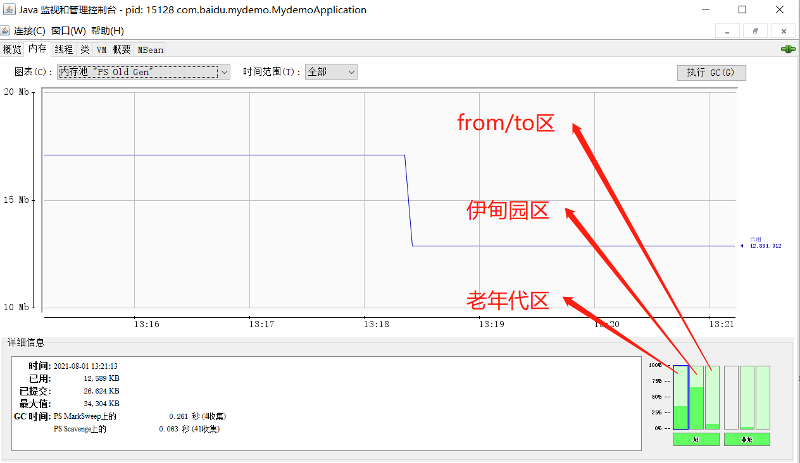
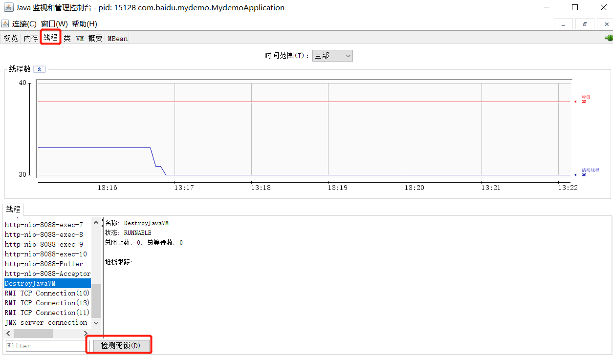
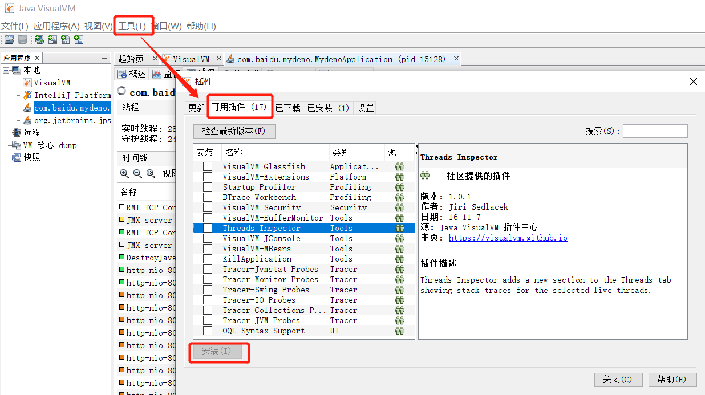

[TOC]

### 3. JVM监控及诊断工具-GUI篇

#### 3.1 工具概述

JDK自带的

- jconsole(不怎么用)
- jvisualvm
- JMC

第三方工具

- MAT(Memory Analyzer Tool)

- JProfiler(需要付费)

- Arthas(阿里开源)
- Btrace


#### 3.2 jconsole(JDK自带工具)

官方地址：https://docs.oracle.com/javase/7/docs/technotes/guides/management/jconsole.html


**堆信息**




**检测死锁**




#### 3.3 jvisualvm(JDK自带工具)

- 官方地址：https://visualvm.github.io/index.html

- 安装插件"visual GC"、"BTrace Workbench"、"Startup Profiler"

- 安装插件的方式
  - 方式1：自动安装插件：https://visualvm.github.io/pluginscenters.html
  - 方式2：visualvm中安装插件：




#### 3.4 JMC(JDK自带工具)

官方地址：https://github.com/JDKMissionControl/jmc


#### 3.5 MAT

MAT(Memory Analyzer Tool)：主要分析dump文件。用于分析堆内存OOM等问题

通过分析大对象找到泄露点

官方地址： https://www.eclipse.org/mat/downloads.php

参考博客：https://mp.weixin.qq.com/s/lhSsQRPTwFc7tf7texDRkg


#### 3.6 JProfiler(收费)

官网地址：https://www.ej-technologies.com/products/jprofiler/overview.html


#### 3.7 Arthas(阿里开源)

特点：在线 且 非图形化

官方地址：https://arthas.aliyun.com/doc/quick-start.html


下载并启动arthas项目

```shell
1.下载地址
  - 方式1：wget https://io/arthas/arthas-boot.jar 
  - 方式2：wget https://arthas/gitee/io/arthas-boot.jar
  - 方式3：https://arthas.aliyun.com/arthas-boot.jar
  
2.启动jar包：java -jar arthas-boot.jar

3.可以用浏览器访问(等同于操作界面)：http://127.0.0.1:8563/ 
```


