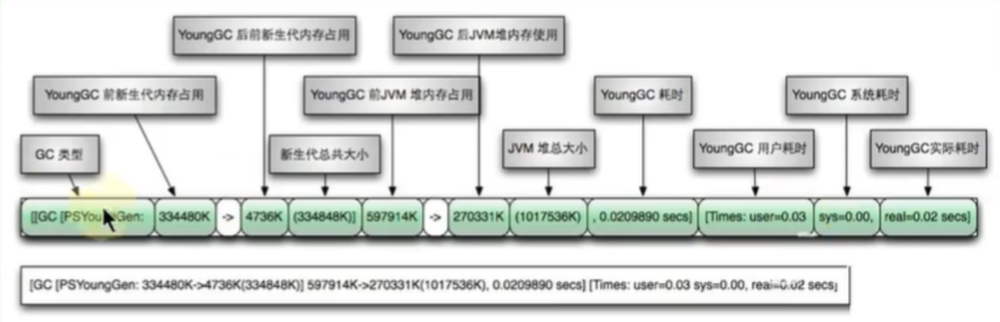
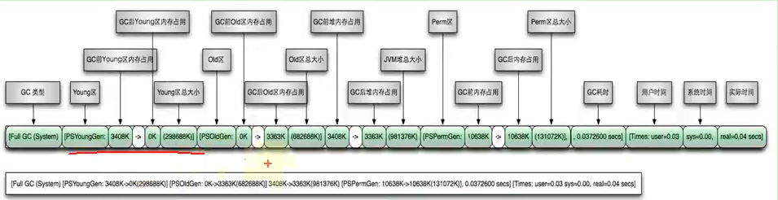

[TOC]

### 5 分析GC日志

#### 5.1 GC分类

###### ①GC分类

GC按照回收区域又分为两大种类型：一种是部分收集（Partial GC），一种是整堆收集（Full GC）

-  部分收集（Partial GC）：不是完整收集整个Java堆的垃圾收集。其中又分为： 
  - 新生代收集（Minor GC / Young GC）：只是新生代（Eden / S0, S1）的垃圾收集
  - 老年代收集（Major GC / Old GC）：只是老年代的垃圾收集。目前，只有CMS GC会有单独收集老年代的行为。注意：很多时候Major GC会和Full GC混淆使用，需要具体分辨是老年代回收还是整堆回收。

-  混合收集（Mixed GC）：收集整个新生代以及部分老年代的垃圾收集。目前，只有G1 GC会有这种行为 

-  整堆收集（Full GC）：收集整个java堆和方法区的垃圾收集

**注：FullGC狭义上指老年代收集；广义上指堆和方法区的垃圾收集**


###### ②触发FullGC的条件

- 老年代空间不足
- 方法区空间不足
- 显式调用System.gc()
- Minor GC进入老年代的数据的平均大小 **大于** 老年代的可用内存
- 大对象直接进入老年代，而老年代的可用空间不足


#### 5.2 GC日志分类

###### ①MinorGC（或young GC或YGC）日志

```shell
[GC (Allocation Failure) [PSYoungGen: 31744K->2192K (36864K) ] 31744K->2200K (121856K), 0.0139308 secs] [Times: user=0.05 sys=0.01, real=0.01 secs
```





###### ②FullGC日志

```shell
[Full GC (Metadata GC Threshold) [PSYoungGen: 5104K->0K (132096K) ] [Par01dGen: 416K->5453K (50176K) ]5520K->5453K (182272K), [Metaspace: 20637K->20637K (1067008K) ], 0.0245883 secs] [Times: user=0.06 sys=0.00, real=0.02 secs]
```





#### 5.3 GC日志结构剖析

##### 5.3.1 透过日志看GC原因

- Allocation Failure：表明本次引起GC的原因是因为新生代中没有足够的区域存放需要分配的数据

- Metadata GCThreshold：Metaspace区不够用了

- FErgonomics：JVM自适应调整导致的GC

- System：调用了System.gc()方法


##### 5.3.2 透过日志看GC前后情况

我们可以发现GC日志格式的规律一般都是：GC前内存占用-＞GC后内存占用（该区域内存总大小）

例如 "[PSYoungGen: 5986K->696K (8704K) ] 5986K->704K (9216K)"

-  中括号内：GC回收前年轻代堆大小，回收后大小(年轻代堆总大小)

-  括号外：GC回收前年轻代和老年代大小，回收后大小(年轻代和老年代总大小)


注意：Minor GC堆内存总容量 = 9/10 年轻代 + 老年代。原因是Survivor区只计算from部分，而JVM默认年轻代中Eden区和Survivor区的比例关系，Eden:S0:S1=8:1:1


#### 5.4 GC日志分析工具

##### ①GCEasy

- 一款在线的GC日志分析器.

- 可以通过GC日志分析进行内存泄露检测、GC暂停原因分析、JVM配置建议优化等功能等

- 官网地址：https://gceasy.io/


##### ②GCViewer

- 一款离线的GC日志分析器

- 源码下载：https://github.com/chewiebug/GCViewer

- 运行版本下载：https://github.com/chewiebug/GCViewer/wiki/Changelog


##### ③GChisto


##### ④HPjmeter

