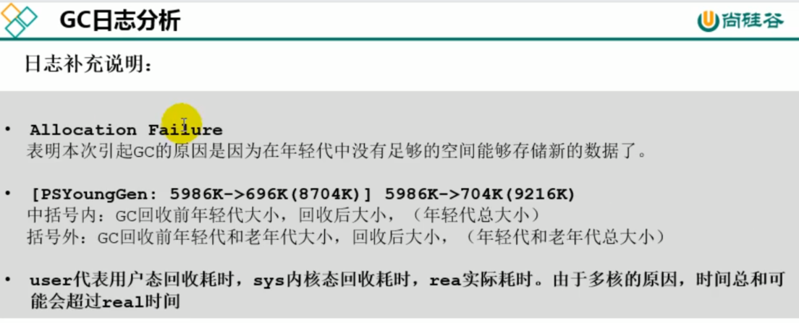
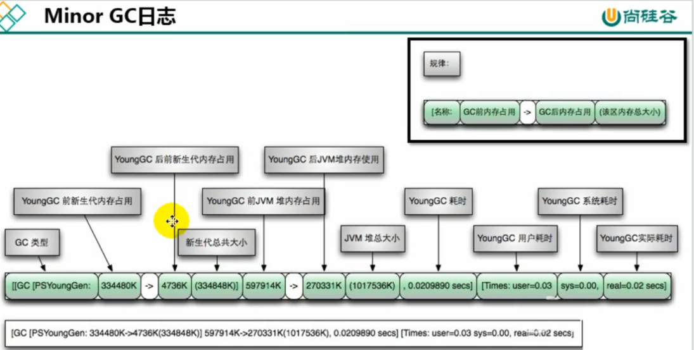
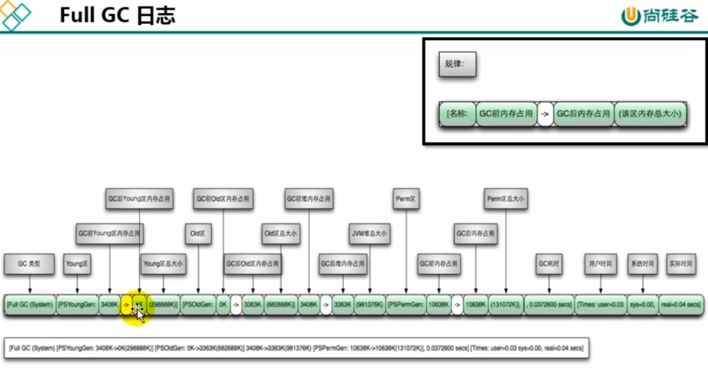

[TOC]


# 分析GC日志

## 1. GC分类

详见【内存与垃圾回收篇】里


## 2.触发FullGC的条件

- 老年代空间不足
- 方法区空间不足
- 显式调用System.gc()
- 大对象直接进入老年代，而老年代的可用空间不足


## 3.GC日志

可以参考【内存与垃圾回收篇】里


### 3.1 YGC日志 和 FullGC日志

**YGC日志**

```shell
[GC (Allocation Failure) [PSYoungGen: 31744K->2192K (36864K) ] 31744K->2200K (121856K), 0.0139308 secs] [Times: user=0.05 sys=0.01, real=0.01 secs
```


**FullGC日志**

```shell
[Full GC (Metadata GC Threshold) [PSYoungGen: 5104K->0K (132096K) ] [Par01dGen: 416K->5453K (50176K) ]5520K->5453K (182272K), [Metaspace: 20637K->20637K (1067008K) ], 0.0245883 secs] [Times: user=0.06 sys=0.00, real=0.02 secs]
```


**GC日志分析**








### 3.2 日志信息

- Allocation Failure：表明本次引起GC的原因是因为新生代中没有足够的区域存放需要分配的数据

- Metadata GCThreshold：Metaspace区不够用了

- FErgonomics：JVM自适应调整导致的GC

- System：调用了System.gc()方法


我们可以发现GC日志格式的规律一般都是：GC前内存占用-＞GC后内存占用（该区域内存总大小）

例如 "[PSYoungGen: 5986K->696K (8704K) ] 5986K->704K (9216K)"

-  中括号内：GC回收前年轻代堆大小，回收后大小(年轻代堆总大小)

-  括号外：GC回收前年轻代和老年代大小，回收后大小(年轻代和老年代总大小)


注意：Minor GC（YGC）堆内存总容量 = 9/10 年轻代 + 老年代。原因是Survivor区只计算from部分，而JVM默认年轻代中Eden区和Survivor区的比例关系，Eden:S0:S1=8:1:1


## 4.GC日志分析工具

### 4.1 GCEasy

- 一款在线的GC日志分析器.

- 可以通过GC日志分析进行内存泄露检测、GC暂停原因分析、JVM配置建议优化等功能等

- 官网地址：https://gceasy.io/


### 4.2 GCViewer

- 一款离线的GC日志分析器

- 源码下载：https://github.com/chewiebug/GCViewer

- 运行版本下载：https://github.com/chewiebug/GCViewer/wiki/Changelog

### 4.3 GChisto

...

### 4.4 HPjmeter

...
