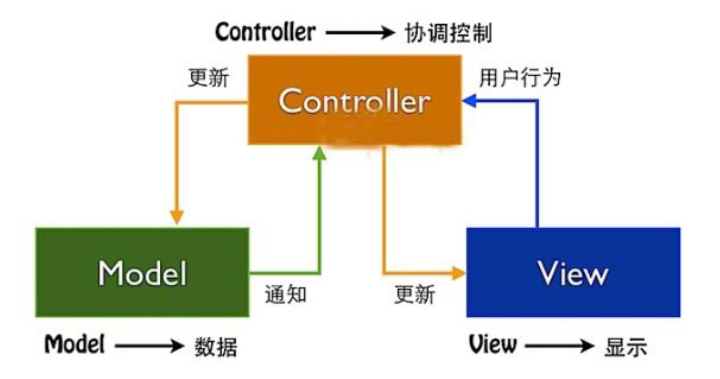

* 1.Vue基础
    * 1.1 Vue的优势
    * 1.2 Vue常用指令
    * 1.3 Vue生命周期
* 2.Vuex
    * 2.1 vue脚手架之vue-cli
    * 2.2 使用vuex
        * 2.2.1 vuex全局存储store数据
        * 2.2.2 view视图使用store中数据
        * 2.2.3 自定义组件


## 1.Vue基础

```vue
npm init -y          -- 初始化npm
npm install vue      -- 下载vue的js文件
npm install axios    -- 下载axios的js文件
npm install jquery   -- 下载jquery的js文件
```


### 1.1 Vue的优势

- 将数据和试图分离，通过改变数据来达到改变试图的效果，便于后期维护
- 所有的指令和axios都是围绕data进行展开





### 1.2 Vue常用指令

- 文本指令：v-text 和 v-html
- 事件指令：v-on。可以简写，例如：@click 是 v-on:click的缩写
- 属性指令：v-bind。可以简写，例如：:class 是v-bind:class 的缩写
- 控制指令：v-model。管理form元素，双向绑定数据
- 循环指令：v-for
- 条件指令：v-if
- 显示指令：v-show 


```html
  vue使用3部曲
    1.导入vue.js
    2.创建一个vue对象  表示从app节点开始渲染节点内的节点
    3.定义vue视图
```


```vue
<!DOCTYPE html>
<html lang="en">
<head>
    <meta charset="UTF-8">
    <title>vue史诗级入门教程</title>
</head>

<body>

    <!--3.定义vue视图-->
    <div id="app">
        <!--3.1 插值表达式-->
        我的名字：{{title}}
        <hr>
        <p>我的性别：{{male==0?"男":"女"}}</p>
        <hr>
        <p>我的年龄：{{myfilter(age,10)}}</p>


        <!--3.2 绑定指令（管理事件）-->
        <!--绑定：单击事件  @click 是 v-on:click的缩写-->
        <!--按键修饰符：回车后直接触发提交方法  @keyup.enter-->
        <p>用户：<input type="text" v-model="user.userName"></p>
        <p>密码：<input type="text" v-model="user.password"></p>
        <!--
            <p>密码：<input type="text" v-model="user.password" @keyup.enter="login"></p>
        -->
        <p><button @click="login">登录</button></p>

        <!--绑定：键盘事件 @keydown 按下键盘 ； @keyup 抬起键盘 -->
        <textarea id="content" name="" cols="30" rows="10" maxlength="140" @keydown="keyDownContent" @keyup="keyDownContent"></textarea>
        <span>你可以输入{{size}}字</span>

        <!--绑定：鼠标时间 @mouseenter 鼠标移入 ； @mouseleave 鼠标移出-->
        <div id="divBox" @mouseenter="enter" @mouseleave="outer">我是div鼠标事件</div>

        <!--事件修饰符：抑制默认行为的发生  例如： @click.prevent中的prevent-->
        <!--默认行为：a button input submit ...-->
        <a href="https://www.baidu.com" @click.prevent="gotoBaidu">点击我触发跳转事件</a>
        <!--
            <a href="#" @click.prevent="gotoBaidu">点击我触发跳转事件</a>
            <a href="javascript:void(0);" @click ="gotoBaidu">点击我触发跳转事件</a>
        -->


        <!--3.3 属性指令（管理属性）  将属性与data绑定  :class 是v-bind:class 的缩写 -->
        <span :content="content"></span>


        <!--3.4 v-text 和 v-html（文本指令） ：和插值表达式都具有计算、三目、调用内置方法-->
        <p v-html="content"></p>
        <p v-text="male==0?'男':'女'"></p>


        <!--3.5 v-model（管理form元素） 双向绑定-->


        <!--3.6 v-for-->
        <p v-for="(user,index) in users">
            {{index + 1}} , {{user.name}} , {{user.age}}
        </p>


        <!--3.7 v-if 和 v-show 显示或者隐藏-->
        <p v-if="male==1">我的性别：男</p>

        <p v-show="flag">我是一个p标签</p>
        <button @click="hideFlag">隐藏</button>
        <button @click="showFlag">显示</button>


        <!--全局组件的使用-->
        <yl-button youli="我是youli按钮"></yl-button>
        <!--1.自定义属性：父组件数据传给子组件-->
        <!--子组件绑定父组件 用父组件给子组件传值 v-bind-->
        <yl-button :youli="title"></yl-button>
        <!--2.自定义事件：子组件将数据传给父组件-->
        <!--子组件触发父组件事件  this.$emit-->
        <yl-button @myevent="gotoBaidu">触发父组件事件</yl-button>


        <!--插槽的使用  <slot>-->
        <xjq-button>新增</xjq-button>
        <xjq-button>修改</xjq-button>
        <xjq-button>删除</xjq-button>
    </div>

    <!--1.导入vue.js-->
    <script src="../js/vue.min.js"></script>

    <script>
        Vue.component('xjq-button',{
            template:"<button><slot></slot></button>"
        });


        // 全局组件：vue组件的全局注册
        Vue.component('yl-button',{
            // 如果没有传"youli"属性，就用cname作为默认值
            template:"<button @click='clickme'>{{youli || cname}}</button>",
            // props：自定义属性  解决父组件给子组件传值（通过 v-bind 绑定）
            props: ["youli"],
            data:function () {
                return{
                    cname:"我是一个按钮"
                }
            },
            methods:{
                clickme:function () {
                    alert("我是组件的事件");
                    this.$emit('myevent',{name:"youli"})
                }
            },
            created:function () {
                this.cname = "我是按钮";
            },
            computed:function () {},
            watch:function () {}
        });

        // 2.创建一个vue对象  表示从app节点开始渲染节点内的节点
        // 定义vue的model模型
        var vm = new Vue({
            el:"#app",
            data:{
                title:"我是君莫笑",
                male:1,
                age:20,
                size:140,
                content:"<strong>我是带标签的文本</strong>",
                flag:true,
                user:{},
                users:[
                    {
                        name:"zhangsan",
                        age:"14"
                    },
                    {
                        name:"xiaoming",
                        age:"12"
                    },
                    {
                        name:"xiaohong",
                        age:"13"
                    }
                ]
            },
            methods:{
                myfilter:function (val,num) {
                    return val + num;
                },
                login:function () {
                    console.log("你点击了我");
                    var userName = this.user.userName;
                    var password = this.user.password;
                    alert("我的名字和密码是：" + userName + password)
                },
                keyDownContent:function () {
                    var content = document.getElementById("content").value;
                    this.size = 140 - content.length;
                },
                enter:function () {
                    document.getElementById("divBox").style.background = "red";
                    document.getElementById("divBox").style.fontSize = "24px";
                },
                outer:function () {
                    document.getElementById("divBox").style.background = "green";
                    document.getElementById("divBox").style.fontSize = "14px";
                },
                gotoBaidu:function (obj) {
                    alert("去百度..." + obj.name);
                    return "i love you";
                },
                hideFlag:function () {
                    this.flag = false
                },
                showFlag:function () {
                    this.flag = true
                }
            },
            // 生命周期钩子
            created(){
                console.log("组件加载完后执行此处")
            },
            // 组件属性
            props:{},
            // 计算属性（相比methods具有监听作用）
            comments:{},
            // 监听属性
            watch:{},
            // 局部组件
            components:{
                'ylxjq-button':{
                    template: "<button @click='clickme'>{{title}}</button>",
                    data:function () {
                        return{
                            title:"我是一个按钮"
                        }
                    },
                    methods:{
                        clickme:function () {
                            alert("我是组件的事件")
                        }
                    }
                }
            }
        });
    </script>

</body>
</html>
```


### 1.3 Vue生命周期

- 1.new Vue()
- 2.beforeCreate
- 3.created：可以拿到data。**实际用的多**
- 4.beforeMount
- 5.mounted **实际用的多**
  - beforeUpdate（数据更改才触发）
  - updated（数据更改才触发）
- 6.beforeDestroy
- 7.destroyed（销毁vue。实际不会这么做）


## 2.Vuex

Vuex的作用
- store文件夹的index.js
- 全局存储。vue页面多组件共享数据。相当于java中的session给所有java的类使用

  

### 2.1 vue脚手架之vue-cli

全局安装vue-cli组件（只需要装一次）

```js
npm install -g @vue/cli
```


视图方式安装vue脚手架vue-cli

```js
vue ui
```


注：bable：将es6转成es5的工具


### 2.2 使用vuex

需求：视图将数据放入store全局数据中，并从store中获取全局数据进行展示


#### 2.2.1 vuex全局存储store数据


```js
import Vue from 'vue'
// 1.引用vuex
import Vuex from 'vuex'

// 2.注册vuex插件到vue中 这里是全局注册
Vue.use(Vuex)

// 3.开始给vuex中定义响应式全局数据共享对象this.$store
export default new Vuex.Store({
  // 3.1 定义响应式的数据  类似于data，只不过是全局
  state: {
  	user:{
      nickName:"",
      password:""
    }
  },
  // 3.2 定义改变state数据的行为。直接改变state
  // params从"actions"来
  // commit调用
  // 注：相当于生产线
  mutations: {
    changeUser(state,params){
      state.user.nickName = params.nickName;
      state.user.password = params.params;
    } 
  },
  // 3.3 actions是处理异步数据加载和提交mutations的机制。间接改变state
  // params数据从页面来
  // commit注册  dispatch调用
  // 注：相当于车间（注册生产线）
  actions: {
    login({commit},params){
      commit("changeUser",params);
    }
  },
  // 3.4 对状态state管理的一种过滤处理的机制（实际可以不用）
  getters:{},
  // 3.5 模块化隔离的一种机制（实际可以不用）
  modules: {}
})
```


#### 2.2.2 view视图使用store中数据

```vue
<template>
  <div class="home">
    <Login></Login>  // 使用自定义组件包
    <button @click="toLogin">登录</button>
  </div>
</template>
<script>

// 1.引入自定义组件包   mapActions,mapMutations等叫做解构
import Login from '@/components/Login.vue'
import { mapActions } from 'vuex'
import { mapMutations } from 'vuex'
    
export default {
  name: 'Home',
  // 2.注册自定义组件包
  components: {
    Login
  },
  data(){
    return{
        nickName:"游利",
        password:"xjq"
    } 
  },
  created(){},
  computed:{}, // 相比于methods中的方法，这里面的方法具有响应式（监听）的作用。
  methods:{
    // 3.将数据存到store缓存中  等价于"this.$store.dispatch("login",{nickName,password})"
    ...mapActions({login:'login'}),
    // ...mapMutations({changeUser:'changeUser'})
    toLogin(){
        var nickName = "游利";
        var password = "xjq";
        this.login({nickName,password});
        // this.changeUser({nickName,password});
    }
  }
}
</script>
```


#### 2.2.3 自定义组件

```vue
<template>
  <h3>您当前登录用户是：{{user.nickName}}</h3>
</template>
<script>

import { mapState } from 'vuex'
    
export default {
  name: 'Login',
  props:{
      msg: String
  },
  components: {
  },
  // vuex使用解构mapState。因为实际开发中，除了vuex状态需要响应数据，当前页面还需要控制计算属性。
  computed:{
    // 从store中拿到用户数据  等价于"return this.$store.state.user"
    ...mapState({user:'user'})
  }
}
</script>
```


