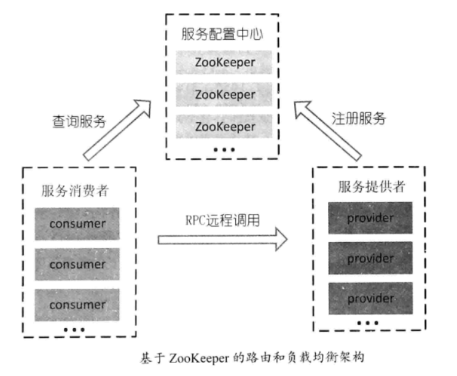

* 1.传统http调用远程服务
  * 1.1 项目图
  * 1.2 模块1：http_provide
  * 1.3 模块2：http_client
  * 1.4 web访问
* 2.RPC远程过程调用
  *  2.1 背景
  *  2.2 HTTP 和 RPC（底层通讯都是基于`socket`）
     * 2.2.1 RPC框架
     * 2.2.2 HTTP实现技术：HttpClient
  *  2.3 RPC的实现
     * 2.3.1 基于TCP协议实现的RPC
     * 2.3.2 基于HTTP协议实现的RPC
     * 2.3.3 基于BIO实现的RPC
     * 2.3.4 基于Netty实现的RPC
     * 2.3.5 基于zk实现的RPC
     * 2.3.6 Dubbo（RPC框架）


## 1.传统http调用远程服务

### 1.1 项目图


### 1.2 模块1：http_provide

```java
server.port=8081
```


```java
@Data
@AllArgsConstructor
@NoArgsConstructor
@Builder
public class Student {

    private Integer id;
    private String model;
    private String name;
}
```


```java
@RequestMapping("/student")
@RestController
public class StudentController {


    @Autowired
    private StudentService studentService;

    @RequestMapping(value = "/getStudentInfo",method = RequestMethod.GET)
    public Student getStudent(){
        return studentService.getStudentInfo();
    }

}
```


```java
@Service
public class StudentService {

    public Student getStudentInfo(){
        return Student.builder()
                .id(1)
                .model("6年纪3班")
                .name("xusan")
                .build();
    }

}
```


### 1.3 模块2：http_client

```
<!-- https://mvnrepository.com/artifact/cn.hutool/hutool-http -->
<dependency>
	<groupId>cn.hutool</groupId>
	<artifactId>hutool-http</artifactId>
	<version>5.7.13</version>
</dependency>
<!-- https://mvnrepository.com/artifact/com.alibaba/fastjson -->
<dependency>
    <groupId>com.alibaba</groupId>
    <artifactId>fastjson</artifactId>
    <version>1.2.75</version>
</dependency>
```


```
server.port=8082
```


```
@RequestMapping("/stu")
@RestController
public class StudentController {

    @Autowired
    private StudentService studentService;


    @RequestMapping(value = "/getData",method = RequestMethod.GET)
    public String getStuInfo(){
        return studentService.getStudentInfo();
    }
}
```


```
@Service
public class StudentService {
    
    private static final String STUDENT_INFO_URL = "http://127.0.0.1:8081/student/getStudentInfo";

    public String getStudentInfo(){
        String stuData = HttpUtil.get(STUDENT_INFO_URL);
        JSONObject jsonStudent = JSON.parseObject(stuData);
        StringBuilder strinStu = new StringBuilder();
        return strinStu.append("查询的学生班级在：")
                .append(jsonStudent.get("model"))
                .append(";").append("姓名是：")
                .append(jsonStudent.get("name"))
                .toString();
    }
}
```


### 1.4 web访问

**提供方**


**消费方**


## 2.RPC远程过程调用

### 2.1 背景

从单机走向分布式，产生了很多分布式的通信方式

- TCP/UDP的二进制：最古老也是最有效的，并且永不过时的。事实上所有通信方式归根到底都是TCP/UDP

- CORBA(Common Object Reqeust Broker Architecute)：古老而复杂的，支持面向对象的通信协议
- Web Service (SOA SOAP RDDI WSDL)：基于http + xml的标准化Web API
- RestFul (Representational State Transfer)：例如：http://www.baidu.com/people/zhangsan。http + json
- RMI(Remote Method Invocation)：Java内部的分布式通信协议
- JMS(Java Message Service)：JavaEE中的消息框架标准，为很多MQ所支持
- RPC(Remote Procedure Call)：远程方法调用，重点在于方法调用（不支持对象的概念），具体实现甚至可以用RMI、RestFul等去实现，但一般不用，因为RMI不能跨语言，而RestFul效率太低。多用于服务器集群间的通信，因此常使用更加高效、短小精悍的传输模式以提高效率


### 2.2 HTTP 和 RPC（底层通讯都是基于`socket`）

#### 2.2.1 RPC框架

- 基于http协议的feign
- 基于私有tcp协议的dubbo：通信协议有http，dubbo等。
  - http协议：连接是多连接，短连接；HTTP传输协议，同步传输；传入传出参数数据包大小混合，提供者比消费者个数多。
  - dubbo协议：连接是单连接，长连接；TCP传输协议，NIO 异步传输；传入传出参数数据包较小，消费者比提供者个数多，适合小数据。


#### 2.2.2 HTTP实现技术：HttpClient


### 2.3 RPC的实现

#### 2.3.1 基于TCP协议实现的RPC
定义：通过Socket编程，实现网络间的二进制字节数组(ByteArray)传输


**RPC基本架构图**


#### 2.3.2 基于HTTP协议实现的RPC
定义：HTTP底层是TCP


#### 2.3.3 基于BIO实现的RPC


#### 2.3.4 基于Netty实现的RPC


#### 2.3.5 基于zk实现的RPC

- zk的心跳检测：客户端和服务端之间通过socket长连接

- zk的感知上线和下线：zk的监听机制。服务端上线和下线服务，客户端会刷新缓存，拉取最新数据。


**ZK注册中心的RPC架构图**




#### 2.3.6 Dubbo（RPC框架）


**Dubbo服务发现架构图**


