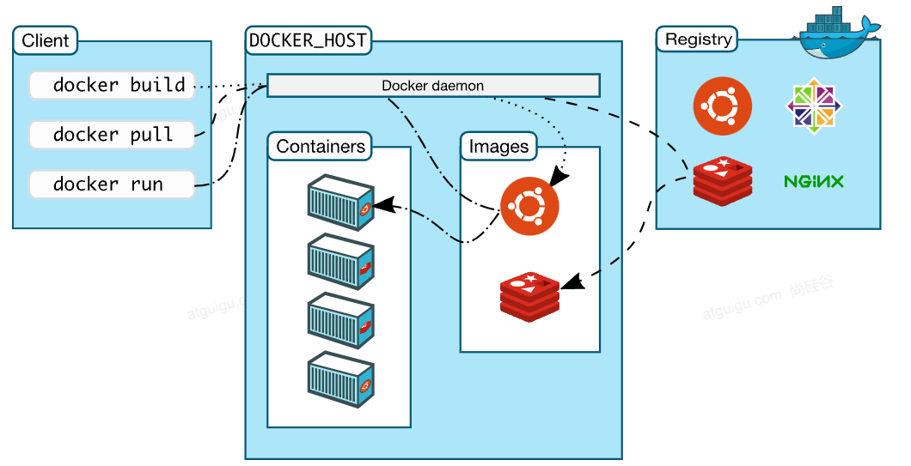

**Docker架构图**

- Registry：远程镜像仓库
- Docker_Host：安装Docker的主机
  - Docker Daemon：运行在Docker主机上的Docker后台进程
  - Images：本地镜像，带环境打包好的程序，可以直接启动运行
  - Containers：容器，由镜像启动起来正在运行中的程序
- Client
  - 操作Docker主机的客户端（命令行、UI等）。
  - 装好**Docker**，然后去 **软件市场** 寻找**镜像**，下载并运行，查看**容器**状态日志等排错。
  - [https://hub.docker.com/_/registr](https://gitee.com/link?target=https%3A%2F%2Fhub.docker.com%2F_%2Fregistr) 检索需要的软件。例如：[https://hub.docker.com/_/mysql?tab=tags](https://gitee.com/link?target=https%3A%2F%2Fhub.docker.com%2F_%2Fmysql%3Ftab%3Dtags)

