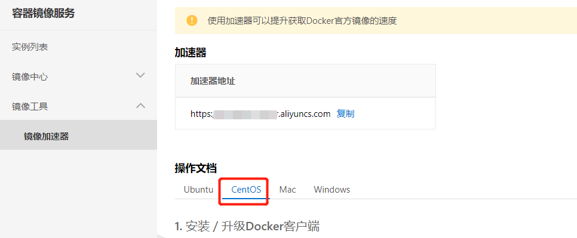

[TOC]


# 安装Docker


官方Centos下安装Docker：[https://docs.docker.com/engine/install/centos/](https://gitee.com/link?target=https%3A%2F%2Fdocs.docker.com%2Fengine%2Finstall%2Fcentos%2F)

### 1.移除之前Docker

```
yum remove docker *
```

### 2.配置yum源

```
# 安装最新yum工具
yum install -y yum-utils

# 修改yum镜像源
yum-config-manager \
--add-repo \
http://mirrors.aliyun.com/docker-ce/linux/centos/docker-ce.repo
```

### 3.安装Docker

```
# docker-ce Docker社区版引擎、docker-ce-cli Docker客户端、containerd.io Docker容器化环境
yum install -y docker-ce docker-ce-cli containerd.io

# 以下是在安装k8s的时候使用  指定了版本
# yum install -y docker-ce-20.10.7 docker-ce-cli-20.10.7  containerd.io-1.4.6

# docker版本查看  如果你需要制定版本可以查一下
# yum list docker-ce --showduplicates | sort -r
```

### 4.启动Docker

```
# 设置开机启动docker 并且 现在也启动
systemctl enable docker --now
```

### 5.配置阿里Docker镜像加速器

```
sudo mkdir -p /etc/docker
sudo tee /etc/docker/daemon.json <<-'EOF'
{
  "registry-mirrors": ["https://d7hr6ivf.mirror.aliyuncs.com"]
}
EOF
sudo systemctl daemon-reload
sudo systemctl restart docker
```


**阿里云提供Docker镜像加速器**




### 6.查看Docker

```
# 查看Docker信息
docker info

# 查看docker版本
docker --version
```


### 7.Docker可视化管理工具Portainer

```yacas
1.下载image docker pull portainer/portainer
2.新增挂载卷 docker volume create portainer_data
3.启动portainer
docker run -d -p 8000:8000 -p 9000:9000 --name=portainer --restart=always \
-v /var/run/docker.sock:/var/run/docker.sock \
-v portainer_data:/data \
portainer/portainer
4.docker ps
5.localhost:9000
```


