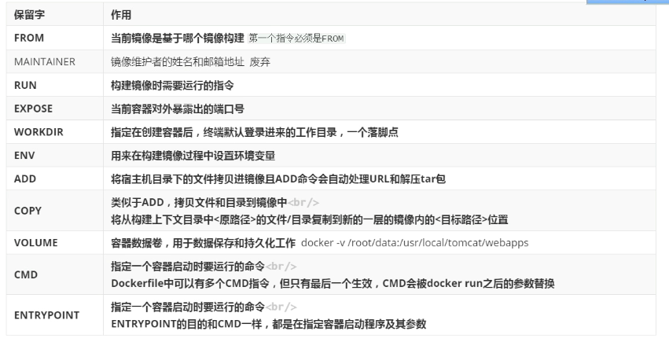

[TOC]


## 1.Dockerfle操作命令




```yacas
# FROM后面引用基础镜像
FROM centos:7
```

```yacas
# RUN 可以执行命令 例如：yum命令
RUN ["yum","install","-y","wget","vim"]
```

```yacas
# 用于以后启动容器时 -p映射被暴露的端口号 
# EXPOSE 8081/tcp  
# EXPOSE 8082/tcp
```

```yacas
# 进入容器会直接到路径/data 
# 例如：docker run -it ...
WORKDIR /data
```

```yacas
# 定义环境变量 BASE_DIR指代"/data/bb"
ENV BASE_DIR /data/bb
```

```yacas
# 将宿主机上的文件拷贝到容器中  ADD可以识别下载url链接 
copy aa.txt $BASE_DIR
ADD bb.txtx $BASE_DIR
ADD apache-tomcat-8.5.61.tar.gz $BASE_DIR
```

```yacas
# 执行命令mv 移动或者改名字
RUN mv apache-tomcat-8.5.61 tomcat
```

```yacas
# 暴露容器中文件路径 启动容器时可以挂载的路径文件
VOLUME $BASE_DIR/tomcat/webapps
```

```yacas
# ENTRYPOINT和CMD都可以指定容器启动需要执行的命令
# CMD的用法：1.运行一个可执行的文件并提供参数 2.为ENTRYPOINT指定参数。
# ENTRYPOINT ["java","-jar","/app.jar"] 运行java包
ENTRYPOINT ["java","-jar"]
CMD ["/app.jar"]
```


## 2.Dockerfile制作镜像

```yacas
1.创建docker目录
2.docker目录下创建Dockerfile文件，即 "touch Dockerfile"
3.将jar包上传到docker目录下
4.在docker目录下执行"docker build -t yygh-hopital:v1.0"
5.docker image 查看镜像
6.docker run -d -p 8021:8021 --name myyygh yygh-hopital:v1.0
8.docker ps 查看启动的容器
9.docker logs -f 容器id 查看容器日志
```

```yacas
- docker目录
  - Dockerfile文件
  - yygh-hosp-8021.jar
```

```yacas
FROM openjdk:8-jre # 基础镜像jre
WORKDIR /app # 进入容器的工作目录
ADD ./yygh-host-8021.jar yygh-host.jar # 将要部署的容器添加到工作目录app下
EXPOSE 8021/tcp # 暴露服务端口号，让启动容器时可以-p映射容器端口
ENTRYPOINT ["java","-jar"] # ENTRYPOINT和CMD配合执行jar包
CMD ["yygh-host-8021.jar"] 
```

**注：maven打包项目 mvn clean package -Dmaven.test.skip=true**


## 3.其他

```yacas
# 基于 openjdk:8-jre 这个基础镜像进行构建
FROM openjdk:8-jre
# 将 本地 jar包 复制到容器内
COPY demo-0.0.1-SNAPSHOT.jar  app.jar
# 开放 8080 端口
EXPOSE 8080
# 运行命令、参数
ENTRYPOINT ["java","-jar"]
CMD ["app.jar"]
```


