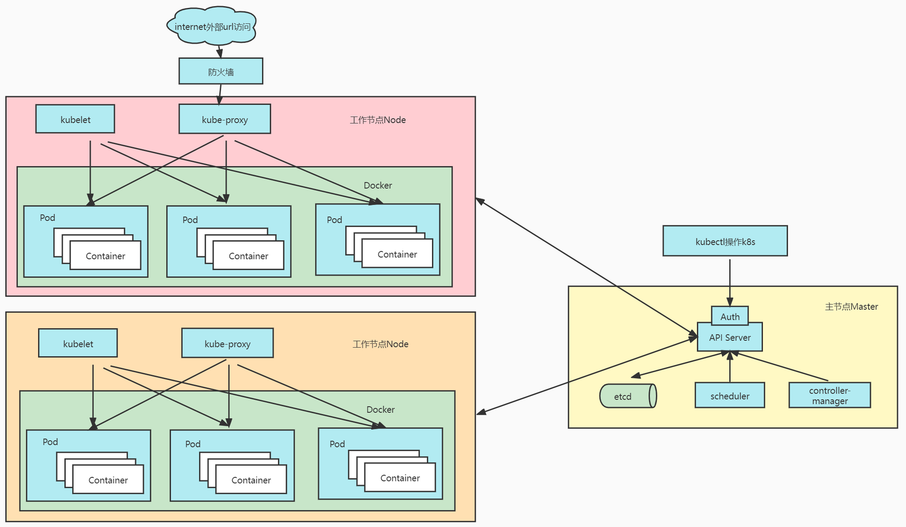

[TOC]

## 1.k8s的安装和介绍

k8s的作用：容器编排

**k8s工作架构**




```yacas
## 主节点master
1.kube-apiserver：外界进行资源操作的唯一入口。提供认证、授权、访问控制、API注册和发现等机制
2.etcd：存数据的
3.kube-scheduler：调度中心。通过读取etcd数据库调度节点node操作k8s运行pod
4.kube-controller-manager：管理中心。节点node管理、pod副本管理等。真正操作k8s的组件。

## Node节点（运行服务）
1.kubelet：一个在集群中每个Node节点上运行的代理。它保证容器都运行在Pod中
2.kube-proxy：负责为提供cluster内部的服务发现和负载均衡
3.容器运行环境(Container Runtime)：支持Docker、rktlet等。默认使用Docker。
4.Pod：一个Pod包含一个或多个容器，提供一个完整的API功能。Pod是k8s中最小的部署单元。
```

```yacas
## 下面，以部署一个nginx服务来说明kubernetes系统各个组件调用关系
1.首先要明确，一旦kubernetes环境启动之后，master和node都会将自身的信息存储到etcd数据库中
2.一个nginx服务的安装请求会首先被发送到master节点的apiServer组件
3.apiServer组件会调用scheduler组件来决定到底应该把这个服务安装到哪个node节点上
4.在此时，它会从etcd中读取各个node节点的信息，然后按照一定的算法进行选择，并将结果告知apiServer
5.apiServer调用controller-manager去调度Node节点安装nginx服务
6.kubelet接收到指令后，会通知docker，然后由docker来启动一个nginx的pod
7.pod是kubernetes的最小操作单元，容器必须跑在pod中至此，
8.一个nginx服务就运行了，如果需要访问nginx，就需要通过kube-proxy来对pod产生访问的代理
```

```yacas
## 安装3大件：kubelet、kubeadm、kubectl
1.kubelet：管理节点。
2.kubeadm：程序员操作k8s集群工具。提供安装k8s的命令
3.kubectl：程序员管理k8s集群工具。常用命令
  - kubectl get nodes # 查看集群所有节点
  - kubectl get pods -A # 相当于 docker ps。运行中的应用在docker里面叫容器，在k8s里面叫Pod
```

```yacas
k8s中的资源
1.Namespace：名称空间。用来隔离pod的运行环境，同个命名空间里的pod可以相互访问。
2.Pod：运行中的一组容器，Pod是kubernetes中应用的最小单位.
3.工作负载
  - Deployment：无状态应用部署，比如微服务，提供多副本等功能。
  - StatefulSet：有状态应用部署，比如redis。
  - DaemonSet：守护型应用部署，比如日志收集组件，在每个机器都运行一份
  - Job/CronJob：定时任务部署， 比如垃圾清理组件，可以在指定时间运行
4.Service：Pod的服务发现与负载均衡。将一组Pods公开为网络服务的抽象方法。暴露一组pod服务。这组中的Pod是相同服务功能。
5.Ingress：Service的统一网关入口。相当于nginx
6.NFS：挂载ConfigMap，实际在etcd中持久化。一个节点会备份其他节点数据。
  - 方式1：原生挂载。将节点文件夹和NFS的文件夹映射挂载
  - 方式2：PVC持久卷申明/PV持久卷 对应 Pod。挂载目录，**推荐使用**
7.Secret：保存敏感信息，例如密码、OAuth令牌和SSH密钥。将这些信息放在 secret 中比放在Pod的定义或者容器镜像中来说更加安全和灵活。
```


## 2.kubeSphere的安装和介绍

kubeSphere主要是简化安装k8s安装的过程，其底层就是k8s

使用kubeKey部署k8s和kubeSphere


## 3.ServiceMesh服务网格

ServiceMesh服务网格主要是将微服务的流量管理、可观测性、安全性能模块下沉到底层，做一个解耦。例如日志模块、告警模块、熔断看板、心跳等模块。就像下图中的外围组件。

常用的ServiceMesh服务网格是Istio等。


**SpringCloud组件配合**


