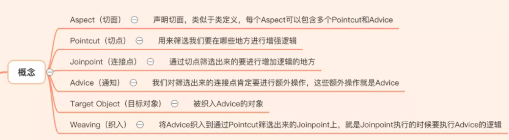
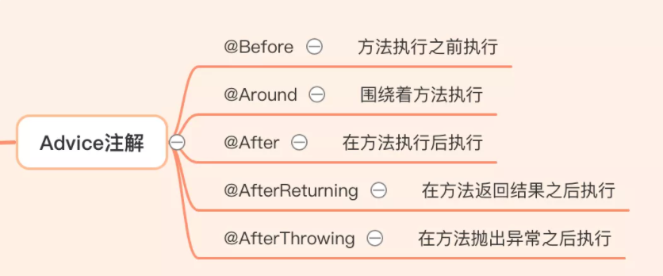
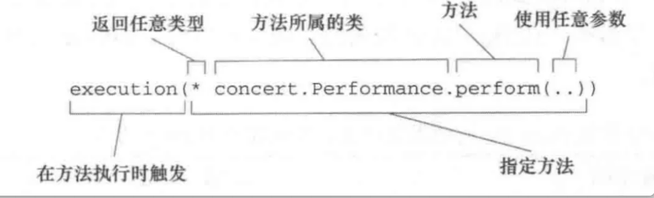
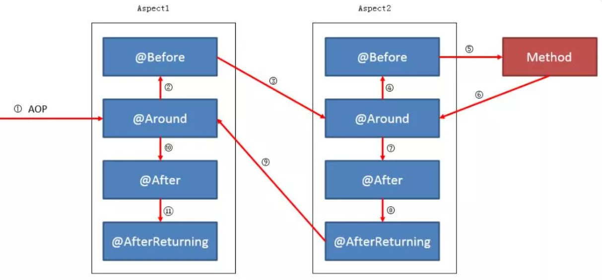

Spring AOP


Spring AOP应用场景

- Spring中的应用场景
  - Spring事务（Transactions）
  - Spring缓存（Caching）
  - Spring本地调度（Scheduling）
- 工程中的应用场景
  - 记录日志
  - 权限控制
  - 分布式事务


Spring AOP中定义

AOP的定义



Advice注解



切点表达式



一个方法被多个AOP拦截



```java

切点执行顺序
@Around->@Before->方法执行->@Around->@After->@AfterReturning/@AfterThrowing

多个aspect的执行顺序可以通过@Order注解或者实现Oreder接口来控制。例如：@Order(2)
    
1.execution的使用
// The execution of any public method:
execution(public * *(..))
// The execution of any method with a name that begins with set
execution(* set*(..))
// The execution of any method defined by the AccountService interface
execution(* com.xyz.service.AccountService.*(..))
// The execution of any method defined in the service package:
execution(* com.xyz.service.*.*(..))
   
2.@annotation的使用    
@annotation(org.springframework.web.annotation.RequestMapping)
@annotation(com.ms.aop.jannotation.demo2.Annotation1) 
    
```


