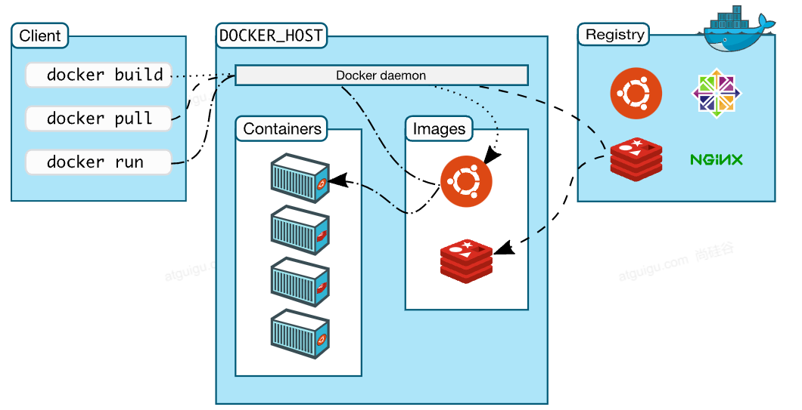
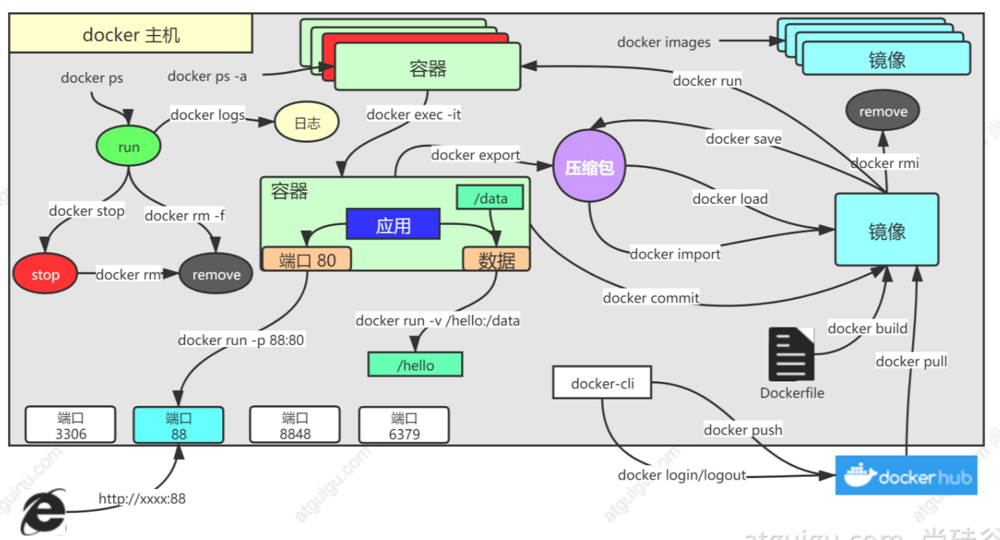
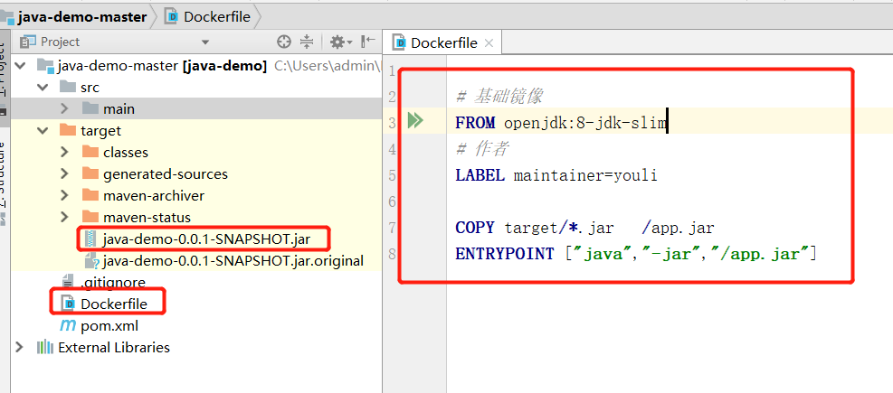
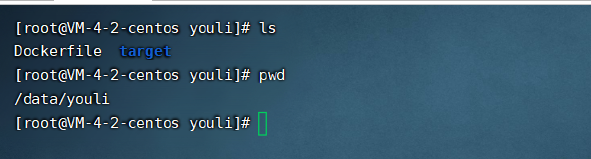

[TOC]


  

# Docker

## 1.Docker架构图




- Registry：镜像仓库

- Docker_Host：安装Docker的主机

  - Docker Daemon：运行在Docker主机上的Docker后台进程

  - Images：镜像，带环境打包好的程序，可以直接启动运行

  - Containers：容器，由镜像启动起来正在运行中的程序

- Client

  - 操作Docker主机的客户端（命令行、UI等）。
  - 装好**Docker**，然后去 **软件市场** 寻找**镜像**，下载并运行，查看**容器**状态日志等排错。
  - https://hub.docker.com/_/registr 检索需要的软件。例如：https://hub.docker.com/_/mysql?tab=tags


## 2.安装并配置Docker

官方Centos下安装Docker：https://docs.docker.com/engine/install/centos/

### 2.1 .移除之前Docker

```bash
yum remove docker *
```

### 2.2 配置yum源

```bash
# 安装最新yum工具
yum install -y yum-utils

# 修改yum镜像源
yum-config-manager \
--add-repo \
http://mirrors.aliyun.com/docker-ce/linux/centos/docker-ce.repo
```

### 2.3 安装Docker

```bash
# docker-ce Docker社区版引擎、docker-ce-cli Docker客户端、containerd.io Docker容器化环境
yum install -y docker-ce docker-ce-cli containerd.io

#以下是在安装k8s的时候使用  指定了版本
yum install -y docker-ce-20.10.7 docker-ce-cli-20.10.7  containerd.io-1.4.6
```

### 2.4 启动Docker

```bash
# 设置开机启动docker 并且 现在也启动
systemctl enable docker --now
```

### 2.5 配置阿里Docker镜像加速器

```bash
sudo mkdir -p /etc/docker
sudo tee /etc/docker/daemon.json <<-'EOF'
{
  "registry-mirrors": ["https://d7hr6ivf.mirror.aliyuncs.com"]
}
EOF
sudo systemctl daemon-reload
sudo systemctl restart docker
```
```bash
# 查看Docker信息
docker info
```


## 3.Docker的常用命令




### 3.1 拉取镜像和删除镜像

```bash
# 镜像名:版本名[:标签]  https://hub.docker.com/_/mysql?tab=tags
docker pull nginx           #下载最新版
docker pull nginx:1.20.1    #下载指定版本
docker pull redis:6.2.4     # 

# 查看所有镜像（下载来的镜像都在本地）  
docker images  

# 删除镜像 注：redis = redis:latest
docker rmi 镜像名:版本号/镜像id
```

### 3.2 启动/停止容器

```bash

# 启动命令
docker run --help    # 查看docker run 的使用
# OPTIONS设置项 、 IMAGE镜像名 、 COMMAND命令
docker run [OPTIONS] IMAGE [COMMAND] [ARG...]

# [OPTIONS] 配置常用启动参数
# --name=xjqnginx 给容器起哥名字 
# -d：后台运行 、 
# --restart=always: 开机自启
# -p 8777:80 : 暴露端口号8777  8777映射内部端口号80
docker run --name=xjqnginx -d --restart=always -p 8777:80 nginx:1.20.1

# 外部访问nginx
http://101.34.59.162:8777/

# 查看正在运行的容器
docker ps
# 查看所有
docker ps -a

# 删除停止的容器
docker rm  容器id/名字
# 强制删除正在运行中的
docker rm -f 容器id/名字

#停止容器
docker stop 容器id/名字
#再次启动
docker start 容器id/名字

#应用开机自启
docker update 容器id/名字 --restart=always

# 服务器重启
reboot

-- 从容器内拷贝到主机上
docker cp 容器id 容器内路径 目的地的主机路径
```

### 3.3 修改容器内容

例如：修改nginx默认的index.html页面

#### 3.3.1 进入容器内部修改（一般不用这种）

```bash
# 进入容器内部的系统，修改容器内容  -it以交互模式
docker exec -it 容器id  /bin/bash
# 退出容器交互模式
exit
docker run --name=xjqredis -d --restart=always -p 8777:6379 redis:6.2.4 
docker exec -it fa5b27f17689257aa79ccd7ca542284c06ce99f5bab358aabeacf36a58d68658 /bin/bash
# 修改nginx中文件的的具体过程
docker exec -it 容器id /bin/bash
whereis nginx                 # 查看nginx的位置
cd /usr/share/nginx           # nginx首页页面的路径
cd html
cat index.html
echo "youli" >index.html      # 将index.html中内容替换成youli
http://101.34.59.162:8777/    # 外部访问

```

#### 3.3.2 挂载数据到外部修改（推荐使用）

```bash
# ro 只读模式（容器里面不可以改） 、 rw 读写模式
# 将容器中nginx的"/usr/share/nginx/html"挂载到外部linux的"/data/html"目录下
docker run --name=mynginx   \
-d  --restart=always \
-p  8777:80 -v /data/html:/usr/share/nginx/html:ro  \
youlinginx:v1.0

# 修改页面只需要去 主机的 /data/html
cd /data/html
echo "youli666" > index.html
# 外网访问
http://101.34.59.162:8777/
```

### 3.4 提交改变（保存到本服务器的镜像中）

```bash
# docker commit提交容器
docker commit --help
docker commit [OPTIONS] CONTAINER [REPOSITORY[:TAG]]

# [OPTIONS]的常用设置 : -a "youli" 用户名 、 -m "首页变化" 修改记录
# CONTAINER：容器id
# [REPOSITORY[:TAG]]："重命名:版本"
docker commit -a "youli"  -m "首页变化" 287016a06473 youlinginx:v1.0

# 查看刚才制作的youlinginx镜像
docker images 

# 启动自己制作的镜像容器
docker run -d -p 8777:80 youlinginx:v1.0
# 查看容器
docker ps

```

### 3.5 镜像传输

```bash

docker save --help
docker save [OPTIONS] IMAGE [IMAGE...]

# 将镜像保存成压缩包 
# docker ps 可以看待容器使用的镜像IMAGE（REPOSITORY:TAG）
docker save -o youlinginx.tar youlinginx:v1.0

# 将本机linux下打包的文件传给其他服务器
scp youlinginx.tar root@121.4.88.61:/opt
# 别的机器加载这个镜像
docker load -i youlinginx.tar
# 查看传过来解压后的镜像
docker images

```

### 3.6 推送到远程仓库（docker hub）

```bash
# docker远程仓库 https://hub.docker.com/
docker tag local-image:tagname new-repo:tagname
docker push new-repo:tagname
```

```bash
# 把旧镜像的名字，改成仓库要求的新版名字
docker tag youlinginx:v1.0 a995525192/youlinginx:v1.0
docker images   # 可以看到新的镜像"a995525192/youlinginx:v1.0"
# 登录到docker hub
docker login       
docker logout（推送完成镜像后退出）
# 推送
docker push a995525192/youlinginx:v1.0
# 别的机器下载
docker pull a995525192/youlinginx:v1.0
```

### 3.7 补充

```bash
# 查看docker容器日志
docker logs 容器名/id   排错

# 进入docker内部修改文件
docker exec -it 容器id /bin/bash

# docker 经常修改nginx配置文件
# 将nginx页面挂载到"/usr/share/nginx/html"
# 将nginx的配置文件挂载到"/data/conf/nginx.conf"
docker run -d -p 80:80 \
-v /data/html:/usr/share/nginx/html:ro \
-v /data/conf/nginx.conf:/etc/nginx/nginx.conf \
--name mynginx-02 \
nginx

#把容器指定位置的东西复制出来 
docker cp 容器id:/etc/nginx/nginx.conf  /data/conf/nginx.conf

#把外面的内容复制到容器里面
docker cp  /data/conf/nginx.conf  容器id:/etc/nginx/nginx.conf
```


## 4.进阶实战

### 4.1 编写自己的应用

```java
初始化项目：https://start.spring.io/
示例代码：  https://gitee.com/leifengyang/java-demo.git
```

### 4.2 安装redis

```bash
# 下载redis镜像
docker pull redis:6.2.4    
# 第一个-v是挂载配置文件，第二个-v是挂载持久化redis使用的
docker run -v /data/redis/redis.conf:/etc/redis/redis.conf \
-v /data/redis/data:/data \
-d --name youliredis \
-p 6379:6379 \
redis:6.2.4 redis-server /etc/redis/redis.conf
# 客户端连接下redis

```

```bash
# redis.conf配置文件
# 持久化
appendonly yes
# 设置redis密码
requirepass xujiaqiyouli
```

### 4.3. 应用打包成镜像

以前

- 1.将springBoot打包成jar包
- 2.将jar包上传服务
- 3.服务器运行java -jar


现在：所有机器都安装Docker，任何应用都是镜像，所有机器都可以运行


打包成Dockerfile




```bash
# 基础镜像
FROM openjdk:8-jdk-slim
# 作者
LABEL maintainer=youli
# 复制jar包
COPY target/*.jar   /app.jar
# 启动命令
ENTRYPOINT ["java","-jar","/app.jar"]
```


```bash

# 打包成jar文件
需要使用maven的package打包
# 上传文件
将jar包和Dockerfile文件上传到服务器
# 构建镜像 
# java-demo:v1.0 是打包后的镜像名字 
# . 是当前目录下
docker build -t java-demo:v1.0 .
# 启动镜像的容器
docker run -d -p 8080:8080 --name myjava java-demo:v1.0
# 外界访问
http://101.34.59.162:8080/hello
# 查看日志
docker logs 容器id
docker logs -f 容器id   # 动态打印日志
```


