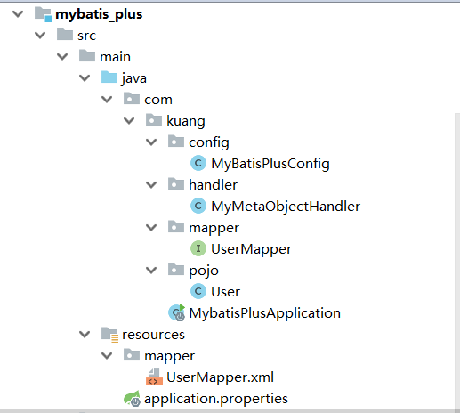

**测试结构图**




## 1.创建SQL语句

```sql
DROP TABLE IF EXISTS user;
CREATE TABLE user
(
id BIGINT(20) NOT NULL COMMENT '主键ID',
name VARCHAR(30) NULL DEFAULT NULL COMMENT '姓名',
age INT(11) NULL DEFAULT NULL COMMENT '年龄',
email VARCHAR(50) NULL DEFAULT NULL COMMENT '邮箱',
create_time datetime COMMENT '创建时间',
update_time datetime COMMENT '修改时间',
userversion  INT(11) COMMENT '乐观锁版本号',
deleted  INT(1) COMMENT '逻辑删除'
PRIMARY KEY (id)
);

INSERT INTO user (id, name, age, email,create_time,update_time,userversion,deleted) VALUES
(1, 'Jone', 18, 'test1@baomidou.com','','',''),
(2, 'Jack', 20, 'test2@baomidou.com','',''),
(3, 'Tom', 28, 'test3@baomidou.com','',''),
(4, 'Sandy', 21, 'test4@baomidou.com','',''),
(5, 'Billie', 24, 'test5@baomidou.com','','');
```


## 2.引入Jar包

```java
<!-- 数据库驱动 -->
<dependency>
    <groupId>mysql</groupId>
    <artifactId>mysql-connector-java</artifactId>
</dependency>
<!-- mybatis-plus -->
<dependency>
    <groupId>com.baomidou</groupId>
    <artifactId>mybatis-plus-boot-starter</artifactId>
    <version>3.0.5</version>
</dependency>
<!-- lombok -->
<dependency>
    <groupId>org.projectlombok</groupId>
    <artifactId>lombok</artifactId>
</dependency>
```


## 3.配置文件和配置类

```java
# 连接数据库
spring.datasource.username=root
spring.datasource.password=root
spring.datasource.url=jdbc:mysql://localhost:3306/ems?useSSL=false&useUnicode=true&characterEncoding=utf-8&serverTimezone=GMT%2B8
spring.datasource.driver-class-name=com.mysql.cj.jdbc.Driver

# 日志输出到控制台
mybatis-plus.configuration.log-impl=org.apache.ibatis.logging.stdout.StdOutImpl

# 逻辑删除
mybatis-plus.global-config.db-config.logic-delete-value=1
mybatis-plus.global-config.db-config.logic-not-delete-value=0
```


```java
// 底层实现是 Interceptor 拦截器
@Configuration                     // 配置类
@MapperScan("com.kuang.mapper")  // 扫描我们的 mapper 文件夹 放到启动类也行
@EnableTransactionManagement       //自动开启事务
public class MyBatisPlusConfig {

    // 注册乐观锁插件（新版已改，去官网看）
    @Bean
    public OptimisticLockerInterceptor optimisticLockerInterceptor() {
        return new OptimisticLockerInterceptor();
    }

    // 分页插件
    @Bean
    public PaginationInterceptor paginationInterceptor() {
        return  new PaginationInterceptor();
    }


    // 逻辑删除组件！（新版删除了，直接配yml,不用注册@Bean了）
    @Bean
    public ISqlInjector sqlInjector() {
        return new LogicSqlInjector();
    }


    /**
     * SQL执行效率插件：测试环境、开发环境才开启（新版已移除）
     */
    @Bean
    @Profile({"dev","test"})// 设置 dev test 环境开启，保证我们的效率
    public PerformanceInterceptor performanceInterceptor() {
        PerformanceInterceptor performanceInterceptor = new PerformanceInterceptor();
        //ms 设置sql执行的最大时间，如果超过了则不执行  超时sql日志会爆红
        performanceInterceptor.setMaxTime(100);
        performanceInterceptor.setFormat(true);
        return performanceInterceptor;
    }

}

```


```java
@Slf4j      //日志打印
@Component // 一定不要忘记把处理器加到IOC容器中！
public class MyMetaObjectHandler implements MetaObjectHandler {

    // 插入时的填充策略
    @Override
    public void insertFill(MetaObject metaObject) {
        log.info("插入时更新时间");
        this.setFieldValByName("createTime",new Date(),metaObject);
        this.setFieldValByName("updateTime",new Date(),metaObject);
    }

    // 更新时的填充策略
    @Override
    public void updateFill(MetaObject metaObject) {
        log.info("更新时更新时间");
        this.setFieldValByName("updateTime",new Date(),metaObject);
    }
    
}
```


## 4.实体类

```java
@Data
@AllArgsConstructor
@NoArgsConstructor
@Accessors(chain=true)
@TableName("user")
public class User implements Serializable{

    /** ID枚举：
     *  1.AUTO(0),          自增id（数据库建表也要勾选 自增选项）
        2.NONE(1),          未设置主键
        3.INPUT(2),         手动设置主键
        4.ID_WORKER(3),     全局唯一id（Long）   默认使用 且 最常用
        5.UUID(4),          全局唯一id
        6.ID_WORKER_STR(5); D_WORKER的字符串表示法
     */
    // 对应数据库中的主键 (uuid、自增id、雪花算法、redis、zookeeper！)
    @TableId(type = IdType.AUTO)
    private Long userid;

    private String username;

    private Integer userage;

    private String useremail;

    //乐观锁Version注解（数据库中默认值给1）
    @Version
    private Integer userversion;

    //逻辑删除（数据库中默认值给0）
    //0 表示未删除  1 表示已删除
    @TableLogic
    private Integer userdeleted;

    // 字段添加填充内容
    @TableField(fill = FieldFill.INSERT)
    private Date createTime;

    @TableField(fill = FieldFill.INSERT_UPDATE)
    private Date updateTime;

}
```


## 5.mapper层

```java
public interface UserMapper extends BaseMapper<User> {

    // 所有的CRUD操作都已经编写完成了
    // 你不需要像以前的配置一大堆文件了！

}
```


```xml
<?xml version="1.0" encoding="UTF-8" ?>
<!DOCTYPE mapper PUBLIC "-//mybatis.org//DTD Mapper 3.0//EN" "http://mybatis.org/dtd/mybatis-3-mapper.dtd" >

<mapper namespace="com.kuang.mapper.UserMapper">


</mapper>
```


## 6.增删改查

```java
@SpringBootTest
class MybatisPlusApplicationTests {

    // 继承了BaseMapper，所有的方法都来自己父类
    // 我们也可以编写自己的扩展方法！
    @Autowired
    private UserMapper userMapper;

    //1. 查询所有
    @Test
    void contextLoads() {
        // 参数是一个 Wrapper ，条件构造器，这里我们先不用 null
        // 查询全部用户
        List<User> users = userMapper.selectList(null);
        users.forEach(System.out::println);
    }

    // 2. 测试插入
    @Test
    public void testInsert(){
        User user = new User();
        user.setUsername("狂神说Java");
        user.setUserage(3);
        user.setUseremail("24736743@qq.com");

        int result = userMapper.insert(user); // 帮我们自动生成id
        System.out.println(result);             // 受影响的行数
        System.out.println(user);               // 发现，id会自动回填
    }

    // 3. 测试更新
    @Test
    public void testUpdate(){
        User user = new User();
        // 通过条件自动拼接动态sql
        user.setUserid(3L);
        user.setUsername("关注公众号：狂神说");
        user.setUserage(20);
        // 注意：updateById 但是参数是一个 对象！
        int i = userMapper.updateById(user);
        System.out.println(i);
    }

    // 4.1 测试乐观锁成功！
    @Test
    public void testOptimisticLocker(){
        // 1、查询用户信息
        User user = userMapper.selectById(1L);
        // 2、修改用户信息
        user.setUsername("kuangshen");
        user.setUseremail("24736743@qq.com");
        // 3、执行更新操作
        userMapper.updateById(user);
    }


    // 4.2 测试乐观锁失败！多线程下
    @Test
    public void testOptimisticLocker2(){

        // 线程 1
        User user = userMapper.selectById(1L);
        user.setUsername("kuangshen111");
        user.setUseremail("24736743@qq.com");

        // 模拟另外一个线程执行了插队操作
        User user2 = userMapper.selectById(1L);
        user2.setUsername("kuangshen12222");
        user2.setUseremail("24736743@qq.com");
        userMapper.updateById(user2);

        // 自旋锁来多次尝试提交！
        userMapper.updateById(user); // 如果没有乐观锁就会覆盖插队线程的值！
    }

    // 5. 测试查询
    @Test
    public void testSelectById(){
        User user = userMapper.selectById(1L);
        System.out.println(user);
    }

    // 6. 测试批量查询！
    @Test
    public void testSelectByBatchId(){
        List<User> users = userMapper.selectBatchIds(Arrays.asList(1, 2, 3));
        users.forEach(System.out::println);
    }
    
    // 7. 按条件查询之一使用map操作
    @Test
    public void testSelectByBatchIds(){
        HashMap<String, Object> map = new HashMap<>();
        // 自定义要查询
        map.put("name","狂神说Java");
        map.put("age",3);

        List<User> users = userMapper.selectByMap(map);
        users.forEach(System.out::println);
    }

    // 8.测试分页查询
    @Test
    public void testPage(){
        //  参数一：当前页（从第1页开始）
        //  参数二：页面大小
        //  使用了分页插件之后，所有的分页操作也变得简单的！
        Page<User> page = new Page<>(1,2);
        LambdaQueryWrapper<User> userLambdaQueryWrapper = new LambdaQueryWrapper<>();
        IPage<User> userIPage = userMapper.selectPage(page, userLambdaQueryWrapper);
        //获取分页后的总条数
        System.out.println(page.getTotal());
        System.out.println(userIPage.getPages());
        //获取分页后的结果
        userIPage.getRecords().forEach(System.out::println);
    }

    // 9. 测试删除
    @Test
    public void testDeleteById(){
        userMapper.deleteById(1L);
    }

    // 10. 通过id批量删除
    @Test
    public void testDeleteBatchId(){
        userMapper.deleteBatchIds(Arrays.asList(1240620674645544961L,1240620674645544962L));
    }

    // 11. 通过map删除
    @Test
    public void testDeleteMap(){
        HashMap<String, Object> map = new HashMap<>();
        map.put("name","狂神说Java");
        userMapper.deleteByMap(map);
    }

}
```


```java
@SpringBootTest
public class WrapperTest {

    @Autowired
    private UserMapper userMapper;

    //1.查询 name不为空的用户、邮箱不为空的用户、年龄大于等于12
    @Test
    void contextLoads() {
        // 查询name不为空的用户，并且邮箱不为空的用户，年龄大于等于12
        QueryWrapper<User> wrapper = new QueryWrapper<>();
        wrapper
                .isNotNull("name")
                .isNotNull("email")
                .ge("age",12);
        userMapper.selectList(wrapper).forEach(System.out::println); // 和我们刚才学习的map对比一下
    }

    //2. 查询一个"name"为"狂神说"的数据
    @Test
    void test2(){
        // 查询名字狂神说
        QueryWrapper<User> wrapper = new QueryWrapper<>();
        wrapper.eq("name","狂神说");
        User user = userMapper.selectOne(wrapper); // 查询一个数据，出现多个结果使用List 或者 Map
        System.out.println(user);
    }

    //3. 查询年龄在 20 ~ 30 岁之间的用户
    @Test
    void test3(){
        // 查询年龄在 20 ~ 30 岁之间的用户
        QueryWrapper<User> wrapper = new QueryWrapper<>();
        wrapper.between("age",20,30);// 区间
        Integer count = userMapper.selectCount(wrapper);// 查询结果数
        System.out.println(count);
    }

    //4. 模糊查询
    @Test
    void test4(){
        // 查询年龄在 20 ~ 30 岁之间的用户
        QueryWrapper<User> wrapper = new QueryWrapper<>();
        // likeRight t%  ; likeLeft %t
        wrapper
                .notLike("name","e")
                .likeRight("email","t");

        List<Map<String, Object>> maps = userMapper.selectMaps(wrapper);
        maps.forEach(System.out::println);
    }

    // 5. 模糊查询（子查询）
    @Test
    void test5(){
        QueryWrapper<User> wrapper = new QueryWrapper<>();
        // id 在子查询中查出来
        wrapper.inSql("id","select id from user where id<3");

        List<Object> objects = userMapper.selectObjs(wrapper);
        objects.forEach(System.out::println);
    }

    //6. 排序
    @Test
    void test6(){
        QueryWrapper<User> wrapper = new QueryWrapper<>();
        // 通过id进行排序
        wrapper.orderByAsc("id");

        List<User> users = userMapper.selectList(wrapper);
        users.forEach(System.out::println);
    }

}
```


**mybatis-plus中联表查询**
```java

-- 1.实体类SysLoginUser（略）

-- 2.controller层
@RestController
public class SysLoginUserController {

    @Autowired
    ISysLoginUserService sysLoginUserService;
    
     /**
     * 分页查询数据返回列表
     *
     * http://localhost:8088/api/user/listpage?pageNo=1&pageSize=2
     * @return
     */
    @GetMapping("/api/user/roles/page")
    public IPage<SysLoginUser> rolepage() {
        return sysLoginUserService.findLoginUserPage(1,10);
    }
}


-- 3.service层
public interface ISysLoginUserService extends IService<SysLoginUser> {

    IPage<SysLoginUser> findLoginUserPage(int pageNo,int pageSize);
}


-- 4.service实现层
@Slf4j
@Service
public class SysLoginUserServiceImpl extends ServiceImpl<SysLoginUserMapper, SysLoginUser> implements ISysLoginUserService {

    /**
     * 实现了多表关联查询分页
     * @param pageNo
     * @param pageSize
     * @return
     */
    public IPage<SysLoginUser> findLoginUserPage(int pageNo, int pageSize){
        Page<SysLoginUser> page = new Page<>(pageNo,pageSize);
        QueryWrapper<SysLoginUser> queryWrapper = new QueryWrapper<>();
        queryWrapper.eq("su.status",1);
        queryWrapper.eq("su.isdelete",0);
        return this.baseMapper.findLoginUserPage(page,queryWrapper);
    }
}


-- 5.mapper层
-- 别名"ew"是固定的
public interface SysLoginUserMapper extends BaseMapper<SysLoginUser> {
    // 多表关联查询分页
    IPage<SysLoginUser> findLoginUserPage(Page<SysLoginUser> page, @Param("ew") Wrapper<SysLoginUser> queryWrapper);
}

-- 6.mapper.xml层
<?xml version="1.0" encoding="UTF-8" ?>
<!DOCTYPE mapper PUBLIC "-//mybatis.org//DTD Mapper 3.0//EN" "http://mybatis.org/dtd/mybatis-3-mapper.dtd" >
<mapper namespace="com.ksd.orm.pug.mapper.SysLoginUserMapper">

    <select id="findLoginUserPage" resultType="com.ksd.pug.pojo.SysLoginUser">
        SELECT su.* FROM sys_role_user sru
        LEFT JOIN sys_user su ON su.id = sru.sys_user_id
        ${ew.customSqlSegment} # 条件在service层的QueryWrapper中拼接
    </select>

</mapper>

```


## 附录：mybatis-plus代码生成

```java
public class CodeGenerator {

    @Test
    public void run() {

        // 1、创建代码生成器
        AutoGenerator mpg = new AutoGenerator();

        // 2、全局配置
        GlobalConfig gc = new GlobalConfig();
        String projectPath = System.getProperty("user.dir");
        gc.setOutputDir(projectPath + "/src/main/java");
        gc.setAuthor("xuJiaQi");
        gc.setOpen(false);         //生成后是否打开资源管理器
        gc.setFileOverride(false); //重新生成时文件是否覆盖
        gc.setServiceName("%sService");	 //去掉Service层接口的首字母I
        gc.setIdType(IdType.ID_WORKER_STR); //主键策略
        gc.setDateType(DateType.ONLY_DATE); //定义生成的实体类中日期类型
        gc.setSwagger2(true);                //开启Swagger2模式
        mpg.setGlobalConfig(gc);

        // 3、数据源配置
        DataSourceConfig dsc = new DataSourceConfig();
        dsc.setUrl("jdbc:mysql://localhost:3306/kuang_community?useSSL=false&useUnicode=true&characterEncoding=utf-8&serverTimezone=GMT%2B8");
        dsc.setDriverName("com.mysql.cj.jdbc.Driver");
        dsc.setUsername("root");
        dsc.setPassword("root");
        dsc.setDbType(DbType.MYSQL);
        mpg.setDataSource(dsc);

        // 4、包配置
        PackageConfig pc = new PackageConfig();
        pc.setParent("com.baidu");
        pc.setModuleName("blog");      //模块名   生成代码路径  com.baidu.blog.controller等
        pc.setController("controller");
        pc.setEntity("entity");
        pc.setService("service");
        pc.setMapper("mapper");
        mpg.setPackageInfo(pc);

        // 5、策略配置
        StrategyConfig strategy = new StrategyConfig();
        // 设置要映射的表名
        strategy.setInclude("edu_course","edu_course_description");
        //数据库表映射到实体的命名策略（下划线转驼峰命名）
        strategy.setNaming(NamingStrategy.underline_to_camel);
        //生成实体时去掉表前缀
        strategy.setTablePrefix(pc.getModuleName() + "_");
        //数据库表字段映射到实体的命名策略
        strategy.setColumnNaming(NamingStrategy.underline_to_camel);
        // 自动lombok模型   @Accessors(chain = true) setter链式操作
        strategy.setEntityLombokModel(true);
        //填写逻辑删除字段 "deleted"
        strategy.setLogicDeleteFieldName("deleted");
        // 自动填充配置新建时间、修改时间
        TableFill gmtCreate = new TableFill("create_time", FieldFill.INSERT);
        TableFill gmtModified = new TableFill("update_time", FieldFill.INSERT_UPDATE);
        ArrayList<TableFill> tableFills = new ArrayList<>();
        tableFills.add(gmtCreate);
        tableFills.add(gmtModified);
        strategy.setTableFillList(tableFills);
        // 乐观锁  乐观锁版本字段 "version"
        strategy.setVersionFieldName("version");
        //controller层  restful api风格控制器
        strategy.setRestControllerStyle(true);
        //url中驼峰转连字符  localhost:8080/hello_id_2
        strategy.setControllerMappingHyphenStyle(true);
        mpg.setStrategy(strategy);

        // 6、执行
        mpg.execute();
    }
}
```

