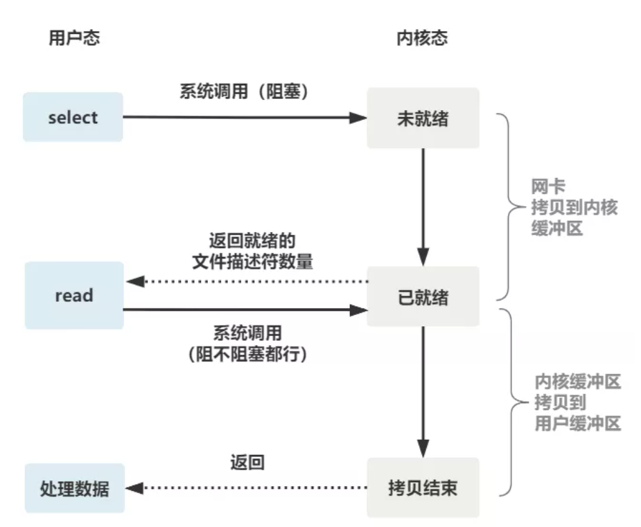

```markdown

-- 原文连接
https://mp.weixin.qq.com/s?__biz=Mzk0MjE3NDE0Ng==&mid=2247494866&idx=1&sn=0ebeb60dbc1fd7f9473943df7ce5fd95&chksm=c2c5967ff5b21f69030636334f6a5a7dc52c0f4de9b668f7bac15b2c1a2660ae533dd9878c7c&scene=178&cur_album_id=1703494881072955395#rd

```


[TOC]

# 阻塞IO、非阻塞IO、IO多路复用

## 1.阻塞IO

 服务端

```

listenfd = socket();   // 打开一个网络通信端口
bind(listenfd);        // 绑定
listen(listenfd);      // 监听
while(1) {
  connfd = accept(listenfd);  // 阻塞建立连接 3次握手4次挥手
  int n = read(connfd, buf);  // 阻塞读数据
  doSomeThing(buf);   // 利用读到的数据做些什么
  close(connfd);      // 关闭连接，循环等待下一个连接
}

```


客户端

```

// 客户端的1次连接
fd = socket();  // 
connect(fd);    // 阻塞  3次握手4次挥手
write(fd,buf);  // 向服务器发送数据
close(fd);      // 关闭连接

```


```

1.启动服务端
2.服务端运行到connfd = accept(listenfd)就一直阻塞进行监听客户端有没有连接
3.一个客户启动客户端去访问服务端
4.客户端进行到connect(fd)就去"3次握手4次挥手"和服务端建立连接
5.连接后服务端int n = read(connfd, buf)阻塞读数据
6.客户端write(fd,buf)向服务器发送数据
7.服务端拿到数据处理后关闭连接，再次监听其他客户端

注：如果这个连接的客户端一直不发数据，那么服务端线程将会一直阻塞在read函数上不返回，也无法接受其他客户端连接。

```


```

服务端的线程阻塞在了两个地方，一个是 accept 函数，一个是 read 函数。
1.accept函数：3次握手4次挥手
2.read函数：阻塞在了两个阶段。网卡拷贝到内核缓冲区；内核缓冲区拷贝到用户缓冲区

```


**阻塞IO的read函数的阻塞两阶段**


## 2.非阻塞IO

```

-- 为了解决上面的问题，其关键在于改造这个 read 函数
-- 每次都创建一个新的进程或线程，去调用 read 函数，并做业务处理
-- 当给一个客户端建立好连接后，就可以立刻等待新的客户端连接，而不用阻塞在原客户端的read请求上
-- 不过，这不叫非阻塞 IO，只不过用了多线程的手段使得主线程没有卡在 read 函数上不往下走罢了。操作系统为我们提供的 read 函数仍然是阻塞的。

while(1) {
  connfd = accept(listenfd);  // 阻塞建立连接
  pthread_create（doWork);    // 创建一个新的线程
}

void doWork() {
  int n = read(connfd, buf);  // 阻塞读数据
  doSomeThing(buf);  // 利用读到的数据做些什么
  close(connfd);     // 关闭连接，循环等待下一个连接
}

```


```

-- 真正的非阻塞 IO，不能是通过我们用户层的小把戏，而是要恳请操作系统为我们提供一个非阻塞的 read 函数
-- 这个 read 函数的效果是，如果没有数据到达时（到达网卡并拷贝到了内核缓冲区），立刻返回一个错误值（-1），而不是阻塞地等待
-- 操作系统提供了这样的功能，只需要在调用 read 前，将文件描述符设置为非阻塞即可。
-- 这样，就需要用户线程循环调用 read，直到返回值不为 -1，再开始处理业务
-- 非阻塞的 read，指的是在数据到达前，即数据还未到达网卡，或者到达网卡但还没有拷贝到内核缓冲区之前，这个阶段是非阻塞的。当数据已到达内核缓冲区，此时调用 read 函数仍然是阻塞的，需要等待数据从内核缓冲区拷贝到用户缓冲区，才能返回。
fcntl(connfd, F_SETFL, O_NONBLOCK);
int n = read(connfd, buffer) != SUCCESS);

```


**非阻塞IO的read函数**


## 3.IO多路复用

非阻塞IO为每个客户端创建一个线程，服务器端的线程资源很容易被耗光。 


我们可以每 accept 一个客户端连接后，将这个文件描述符（connfd）放到一个数组里 

```

fdlist.add(connfd);

```


然后弄一个新的线程去不断遍历这个数组，调用每一个元素的非阻塞 read 方法。这样，我们就成功用一个线程处理了多个客户端连接。 

```

while(1) {
  for(fd <-- fdlist) {
    if(read(fd) != -1) {
      doSomeThing();
    }
  }
}

```


上面的那样也只是用户自己想出的小把戏，每次遍历遇到 read 返回 -1 时仍然是一次浪费资源的系统调用。 所以，还是得恳请操作系统老大，提供给我们一个有这样效果的函数（ select 是操作系统提供的系统调用函数 ），我们将一批文件描述符通过一次系统调用传给内核，由内核层去遍历，才能真正解决这个问题，无用户态到内核态的切换开销。 

```

-- 首先一个线程不断接受客户端连接，并把 socket 文件描述符放到一个 list 里。
while(1) {
  connfd = accept(listenfd);
  fcntl(connfd, F_SETFL, O_NONBLOCK);
  fdlist.add(connfd);
}

```

 

### 3.1 系统提供的select函数

```

-- 然后，另一个线程不再自己遍历，而是调用 select，将这批文件描述符 list 交给操作系统去遍历。
-- 只不过，操作系统会将准备就绪的文件描述符做上标识，用户层将不会再有无意义的系统调用开销。
while(1) {
  // 把一堆文件描述符 list 传给 select 函数
  // 有已就绪的文件描述符就返回，nready 表示有多少个就绪的
  nready = select(list);
  // 用户层依然要遍历，只不过少了很多无效的系统调用
  for(fd <-- fdlist) {
    if(fd != -1) {
      // 只读已就绪的文件描述符
      read(fd, buf);
      // 总共只有 nready 个已就绪描述符，不用过多遍历
      if(--nready == 0) break;
    }
  }
}

```


```

-- 上述select优化
1.select 调用需要传入 fd 数组，需要拷贝一份到内核，高并发场景下这样的拷贝消耗的资源是惊人的。（可优化为不复制）
2.select 在内核层仍然是通过遍历的方式检查文件描述符的就绪状态，是个同步过程，只不过无系统调用切换上下文的开销。（内核层可优化为异步事件通知）
3.select 仅仅返回可读文件描述符的个数，具体哪个可读还是要用户自己遍历。（可优化为只返回给用户就绪的文件描述符，无需用户做无效的遍历）


可以看到，这种方式，既做到了一个线程处理多个客户端连接（文件描述符），又减少了系统调用的开销（多个文件描述符只有一次 select 的系统调用 + n 次就绪状态的文件描述符的 read 系统调用

```


**系统提供的select函数**




### 3.2 系统提供的poll函数

```

它和 select 的主要区别就是，去掉了 select 只能监听 1024 个文件描述符的限制。

```


### 3.3 系统提供的epoll函数

```

epoll是最终的大 boss，它解决了 select 和 poll 的一些问题。 

```


```

select 的三个待优化问题
1.select 调用需要传入 fd 数组，需要拷贝一份到内核，高并发场景下这样的拷贝消耗的资源是惊人的。（可优化为不复制）
2.select 在内核层仍然是通过遍历的方式检查文件描述符的就绪状态，是个同步过程，只不过无系统调用切换上下文的开销。（内核层可优化为异步事件通知）
3.select 仅仅返回可读文件描述符的个数，具体哪个可读还是要用户自己遍历。（可优化为只返回给用户就绪的文件描述符，无需用户做无效的遍历）


epoll主要就是针对这三点进行了改进。
1.内核中保存一份文件描述符集合，无需用户每次都重新传入，只需告诉内核修改的部分即可。
2.内核不再通过轮询的方式找到就绪的文件描述符，而是通过异步 IO 事件唤醒。
3.内核仅会将有 IO事件的文件描述符返回给用户，用户也无需遍历整个文件描述符集合。

```


## 4.小结

```

1.一切的开始，都起源于这个 read 函数是操作系统提供的，而且是阻塞的，我们叫它 阻塞 IO。
2.为了破这个局，程序员在用户态通过多线程来防止主线程卡死。
3.后来操作系统发现这个需求比较大，于是在操作系统层面提供了非阻塞的 read 函数，这样程序员就可以在一个线程内完成多个文件描述符的读取，这就是 非阻塞 IO。
4.但多个文件描述符的读取就需要遍历，当高并发场景越来越多时，用户态遍历的文件描述符也越来越多，相当于在 while 循环里进行了越来越多的系统调用。
5.后来操作系统又发现这个场景需求量较大，于是又在操作系统层面提供了这样的遍历文件描述符的机制，这就是 IO 多路复用。
多路复用有三个函数，最开始是 select，然后又发明了 poll 解决了 select 文件描述符的限制，然后又发明了 epoll 解决 select 的三个不足。

所以，IO 模型的演进，其实就是时代的变化，倒逼着操作系统将更多的功能加到自己的内核而已。

```


```

多路复用产生的效果，完全可以由用户态去遍历文件描述符并调用其非阻塞的 read 函数实现。而多路复用快的原因在于，操作系统提供了这样的系统调用，使得原来的 while 循环里多次系统调用，变成了一次系统调用 + 内核层遍历这些文件描述符。
就好比我们平时写业务代码，把原来 while 循环里调 http 接口进行批量，改成了让对方提供一个批量添加的 http 接口，然后我们一次 rpc 请求就完成了批量添加

```


