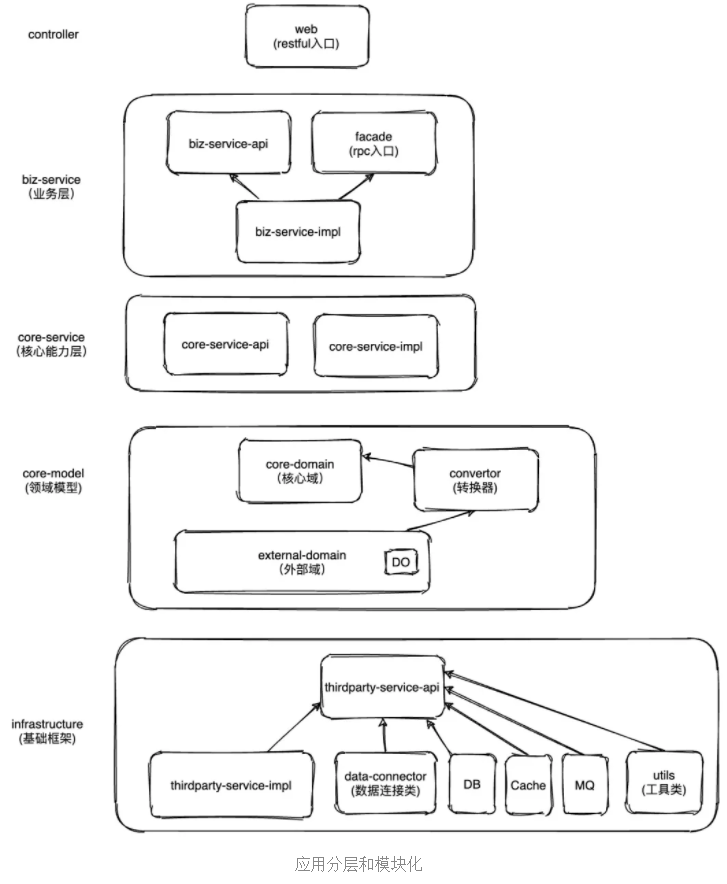

**应用分层和模块化**

- controller（Restful入口）：是http 请求的入口。controller 负责接受web请求HttpRequest, 返回HttpResponse

- biz-service-api：简单的应用不需要区分 biz-service 和 core-service。但是如果业务复杂度比较高，最佳实践是把service 拆二层，即 biz-service + core-service 。biz-service 负责业务逻辑，可以组合core-service层提供的接口；core-service负责通用性的基础能力

- facade（RPC入口）：门面接口，facade 模块只定义接口。facade 一般是提供给外部系统的，打成jar 包，人家依赖你，只需要知道接口定义的出入参，具体实现他不需要关心。你的facade 服务发布成rpc provider，为上游提供服务。

- biz-service-impl：业务逻辑实现，实现facade 接口和 biz-service-api。

- core-service-api：负责通用性的基础能力。比如支付能力、模型运行能力、通用对象定位能力、安全。

- core-domain：放置重要的模型。

- infrastructure：基础的比如数据库、缓存、消息队列、流程引擎、审批流、定时任务这种系统基础设施、第三方外部系统依赖。每引入一个第三方服务或者组件，都定义service-api 和 serviceImpl，api做出通用性的，不依赖具体第三方的存在，相当于api这层后期不用改动，只需要修改service层。