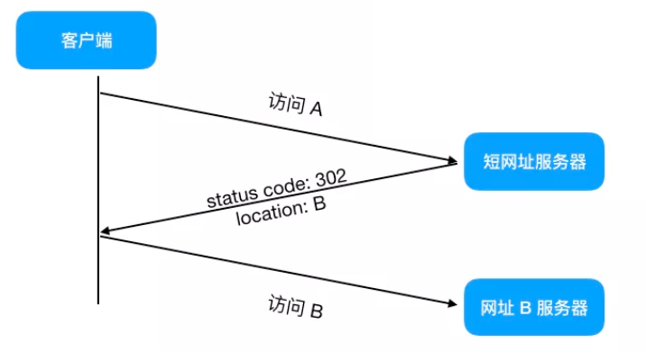
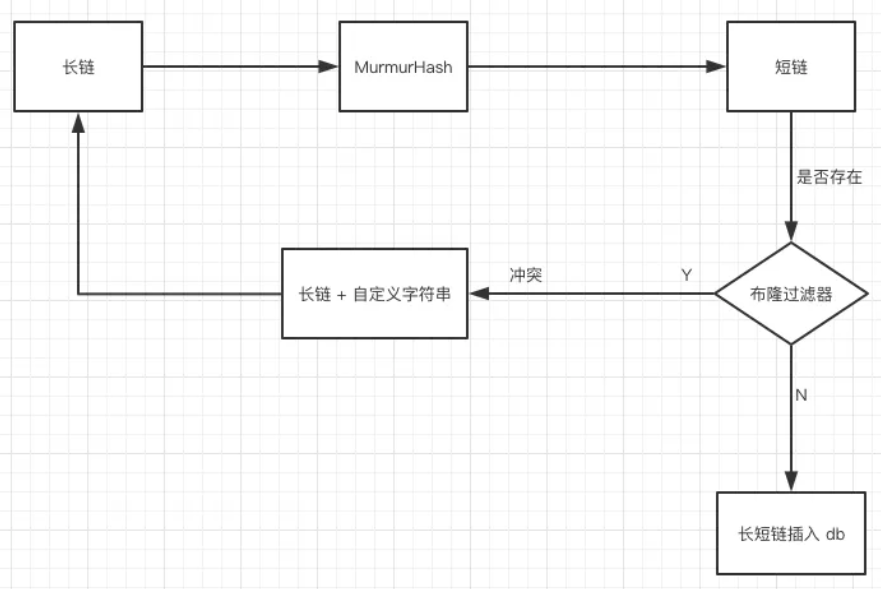
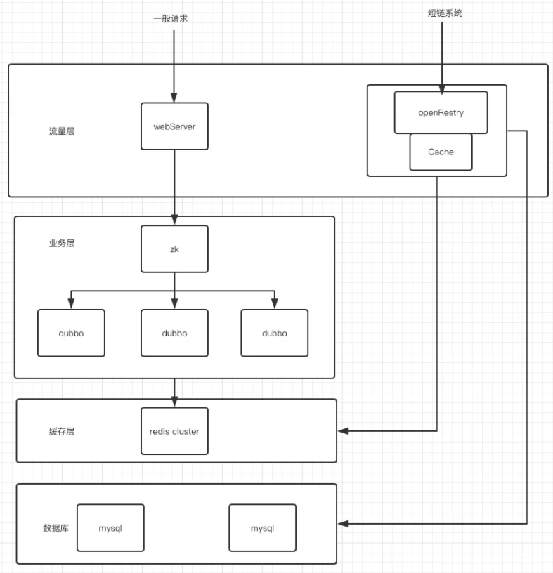

[TOC]


# 高性能短链设计


参考文章：https://mp.weixin.qq.com/s/el1pkwtq7-4mxu89hCDqOw


## 1.长链简化成短链的原理





原理：访问短网址A后重定向访问 B。重定向建议用302

重定向301 和 302
- 301，代表 **永久重定向**，也就是说第一次请求拿到长链接后，下次浏览器再去请求短链的话，不会向短网址服务器请求了，而是直接从浏览器的缓存里拿，这样在 server 层面就无法获取到短网址的点击数了，如果这个链接刚好是某个活动的链接，也就无法分析此活动的效果。所以我们一般不采用 301。
- **302**，代表 **临时重定向**，也就是说每次去请求短链都会去请求短网址服务器（除非响应中用 Cache-Control 或 Expired 暗示浏览器缓存）,这样就便于 server 统计点击数，所以虽然用 302 会给 server 增加一点压力，但在数据异常重要的今天，这点代码是值得的，所以推荐使用 302！


## 2.短链生成方法

### 2.1 哈希算法

哈希算法：路径映射，可以使用 Google的 MurmurHash 算法（**非加密型**哈希函数）。用加密算法MD5，SHA会损失性能，有点杀鸡用牛刀，需要关心的时冲突概率而不是反向解密。





```
CREATE TABLE `short_url_map` (
  `id` int(11) unsigned NOT NULL AUTO_INCREMENT,
  `lurl` varchar(160) DEFAULT NULL COMMENT '长地址',
  `surl` varchar(10) DEFAULT NULL COMMENT '短地址',
  `gmt_create` int(11) DEFAULT NULL COMMENT '创建时间',
  PRIMARY KEY (`id`)
) ENGINE=InnoDB DEFAULT CHARSET=utf8;
```

```
1.将长链（lurl）经过 MurmurHash 后得到短链。
2.再根据短链去 short_url_map 表中查找看是否存在相关记录，如果不存在，将长链与短链对应关系插入数据库中，存储。
3.如果存在，说明已经有相关记录了，此时在长串上拼接一个自定义好的字段，比如「DUPLICATE」，然后再对接接的字段串「lurl + DUPLICATE」做第一步操作，如果最后还是重复呢，再拼一个字段串啊，只要到时根据短链取出长链的时候把这些自定义好的字符串移除即是原来的长链

以上步骤显然是要优化的，插入一条记录居然要经过两次 sql 查询（根据短链查记录，将长短链对应关系插入数据库中），如果在高并发下，显然会成为瓶颈。
```

```
1.首先我们需要给短链字段 surl 加上唯一索引
2.当长链经过 MurmurHash 得到短链后，直接将长短链对应关系插入 db 中，如果 db 里不含有此短链的记录，则插入，如果包含了，说明违反了唯一性索引，此时只要给长链再加上我们上文说的自定义字段「DUPLICATE」,重新 hash 再插入即可，看起来在违反唯一性索引的情况下是多执行了步骤，但我们要知道 MurmurHash 发生冲突的概率是非常低的，基本上不太可能发生，所以这种方案是可以接受的

注：当然如果在数据量很大的情况下，冲突的概率会增大，此时我们可以加布隆过滤器来进行优化
```


### 2.2 自增序列算法

```
我们可以维护一个 ID 自增生成器，比如 1，2，3 这样的整数递增 ID，当收到一个长链转短链的请求时，ID 生成器为其分配一个 ID，再将其转化为 62 进制，拼接到短链域名后面就得到了最终的短网址。
```


```
如果在低峰期发号还好，高并发下，ID 自增生成器的的 ID 生成可能会系统瓶颈，所以它的设计就显得尤为重要
1.uuid
2.Snowflake 雪花算法
3.mysql自增
```


## 3.高性能短链设计

在电商公司，经常有很多活动，秒杀，抢红包等等，在某个时间点的 QPS 会很高，考虑到这种情况，我们引入了 openResty。


**短链设计（引入OpenResty）**




### OpenResty的作用

单个请求："网络 + http服务器 + http到后端通信 + 后端 + 后端到数据库通信 + 数据库"

OpenResty：基于 Nginx（非阻塞IO模型） 与 Lua 的高性能 Web 平台，直接消除了上述的第三项。nginx遇到lua，就相当于孙悟空拿到了金箍棒。**用lua实现业务逻辑**

OpenResty可以轻松支持 100 w + 的并发数


### Web服务器支持的并发量

web服务器有几个选型，Tomcat，Apache，Weblogic还有商用Webphere。
1.Tomcat官方宣称的并发量是1000，厉害点的做点参数调优，也不过3000并发，如果要开发一个并发百万的服务，1000000/3000，需要1000台服务器，想想都不可能。                   
2.Apache的并发比Tomcat更不堪，200-300                                       
3.weblogic的并发稍好，平均能达到3000左右，但是也没有达到好一个数量级


但是nginx就不一样了，处理几万的请求很轻松，内存占用也不高，之前我们只是把它用作负载均衡，没想过当做一个web服务器，OpenResty的出现解决了享受nginx高并发优势的拦路虎，借助nginx用lua实现业务逻辑


mysql的并发量在2000，超过这个量mysql性能就会急剧下降
电商的首页，产品详情页，使用openResty支撑产品详情页的高并发访问，在处理订购单，购物车等环节用其他的高并发框架处理，比如java的NIO网络框架netty
java的netty也是处理高并发的利器，不过我做过测试，整体性能可以达到nginx的80%，所以，脏活累活都让nginx做吧，关键业务用netty（netty也可以用作应用服务器）


腾讯10亿用户，1亿的并发，OpenResty也不行。
1.1000并发，用Tomcat，SpringMVC框架加缓存就可以应对
2.1万的并发在关键节点使用内存处理也很容易，
3.百万并发就需要linux内核调优，socket缓冲区，文件句柄数，内存池，RPS/RFS SMP等优化也可以达到。
4.千万并发就需要考虑用户态协议dpdk了


