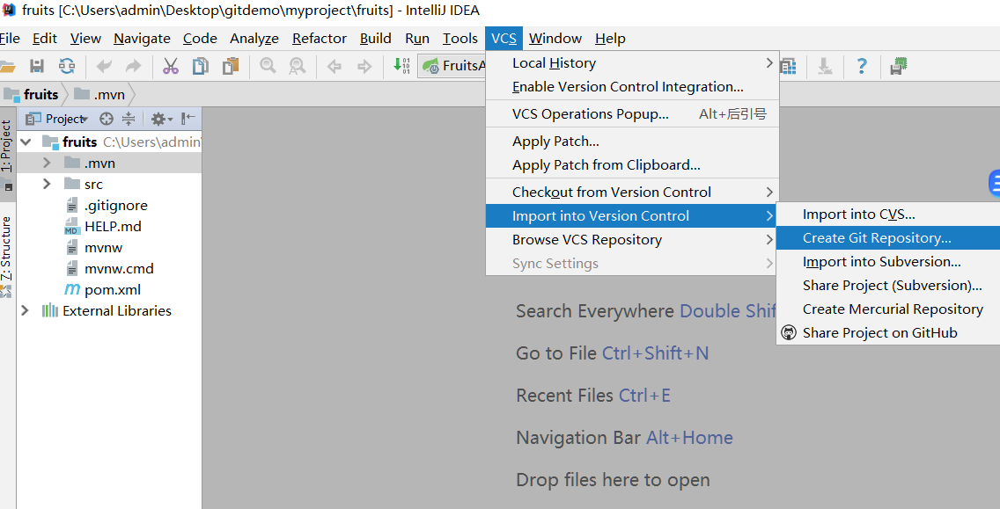
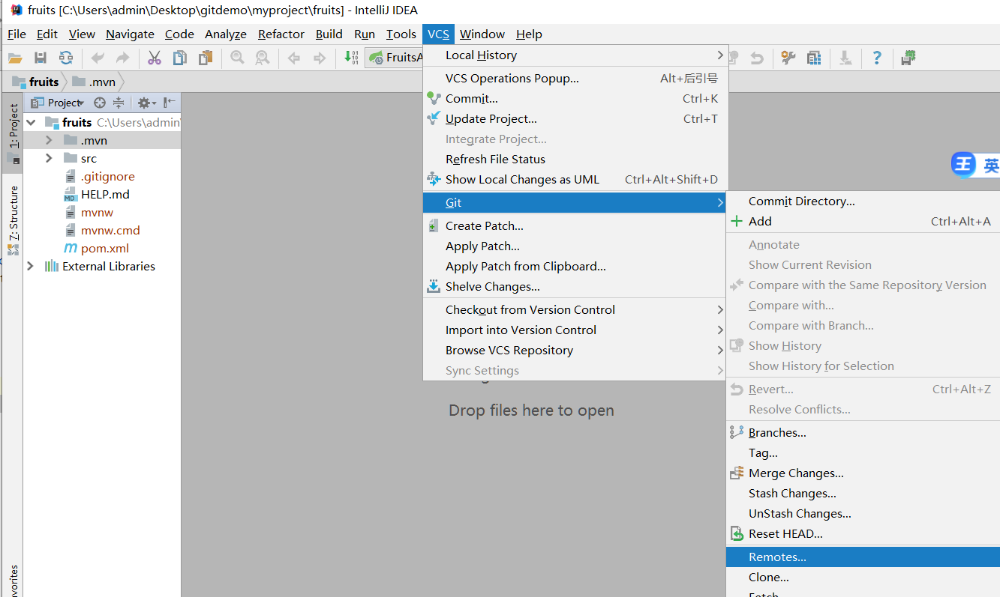
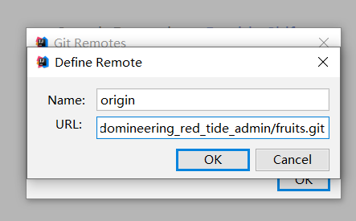
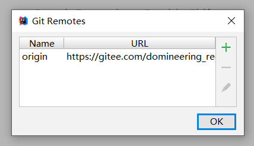
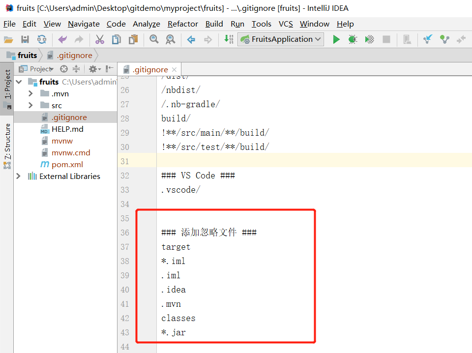

[TOC]

### 1.gitee码云上新建项目

### 2.复制并保存远程新建项目地址

复制内容：https://gitee.com/domineering_red_tide_admin/fruits.git

### 3.新建本地springboot项目

**注：项目名字要和gitee码云项目名字对应**

### 4.本地IDE打开本地新建项目

### 5.本地项目添加GIT管理

### 6.本地项目关联远程gitee码云项目

### 7.添加忽略文件格式

### 8.初始化项目 上传修改文件

> git add .
> git commit -m "初始化项目"
> git push --set-upstream origin master

